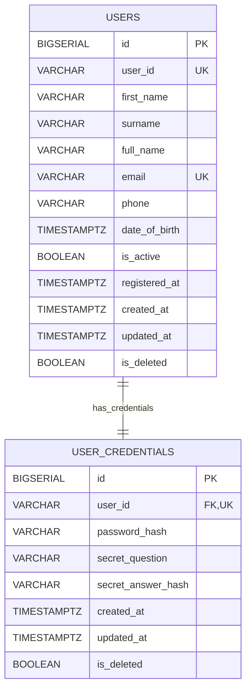
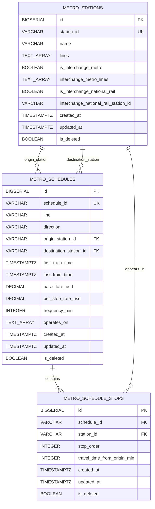
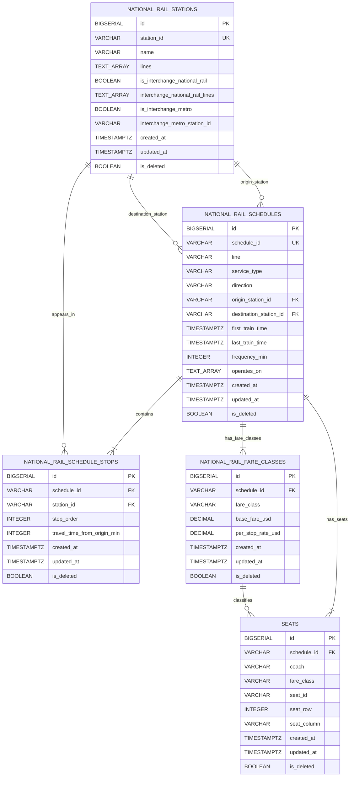
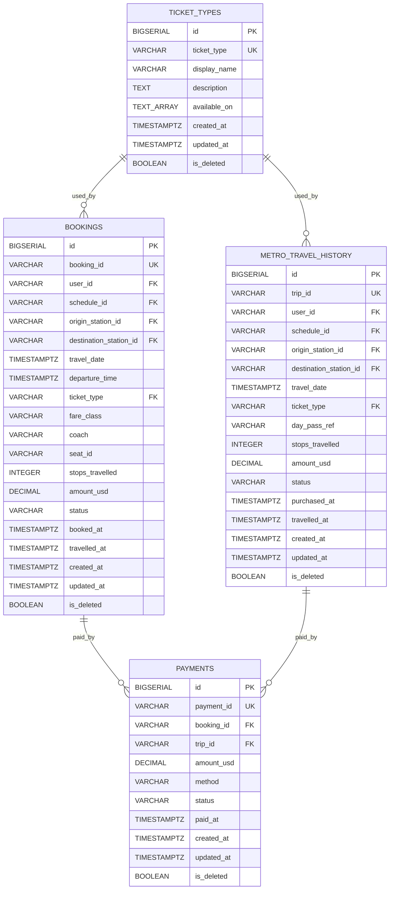
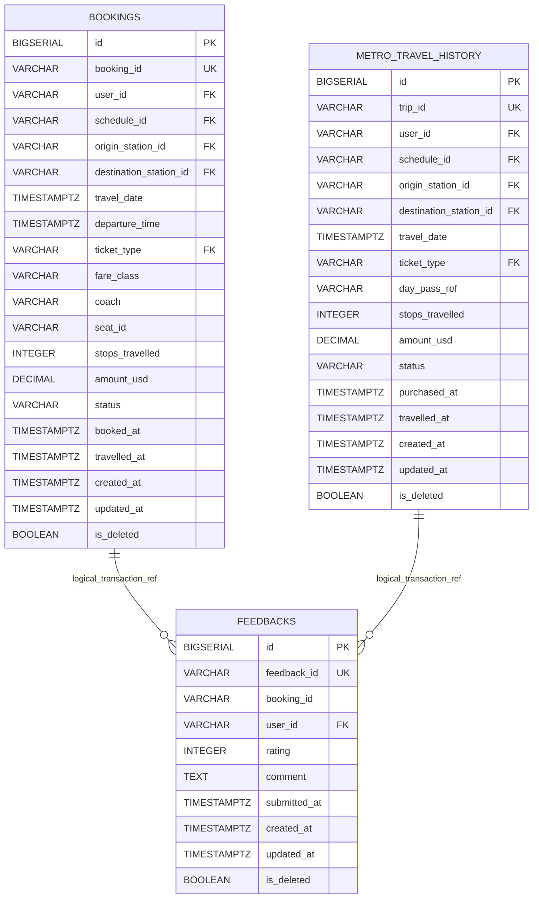
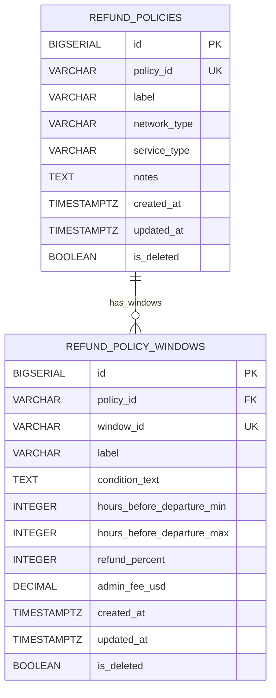
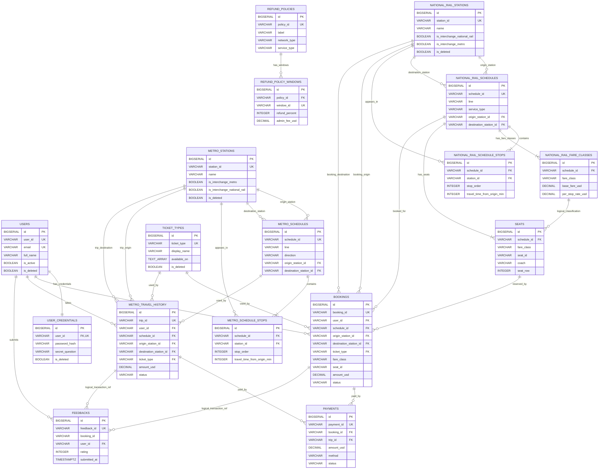

# ER Diagram for TransitFlow

本系統的 relational database 主要用來支援 TransitFlow 的結構化資料管理，包括車站、班次、停靠站順序、票價、座位、使用者、訂票紀錄、付款紀錄、回饋與退款政策等資料。整體 ERD 共使用 17 張主要 relational tables，分別涵蓋 Metro、National Rail、User/Auth、Transaction/Payment，以及 Refund Policy 等功能區塊。

為了讓 ERD 更清楚，本文件會先將資料表分成幾個區塊逐步呈現：

- Step 1：User / Auth 區
- Step 2：Metro 區
- Step 3：National Rail 區
- Step 4：Transaction / Payment 區
- Step 5： Refund Policy 區
- Step 6：整體 ERD 與跨分區關係

每個區塊內部的表關係最密集，先分區畫可以讓圖更清楚，避免一開始圖形過於複雜，難以評斷，最後一小節會將跨分區關係整合成完整 ERD，呈現統整結果並說明跨分區的關係。

## Section 1：User / Auth

### 1. Tables and Attributes

#### `users`

```text
users
- id PK
- user_id UK
- first_name
- surname
- full_name
- email UK
- phone
- date_of_birth
- is_active
- registered_at
- created_at
- updated_at
- is_deleted
```

#### `user_credentials`

```text
user_credentials
- id PK
- user_id FK, UK
- password_hash
- secret_question
- secret_answer_hash
- created_at
- updated_at
- is_deleted
```

### 2. Mermaid ERD



### 3. Relationship Explanation

#### User / Auth 區主要由 users 與 user_credentials 兩張表組成。

users 表儲存使用者基本資料，例如姓名、email、電話、生日、帳號狀態與註冊時間；user_credentials 表則儲存登入與帳號復原相關資料，例如 password_hash、secret_question 和 secret_answer_hash。這樣的設計讓使用者 profile 資料和認證資料分離，符合安全性與資料管理上的需求。

兩張表之間的關係是：

```text
users 1 ─── 1 user_credentials
```

在 Mermaid 圖中用：

```text
USERS ||--|| USER_CREDENTIALS : has_credentials
```

表示 1:1 relationship。

這個 cardinality 的依據是 user_credentials.user_id：

```sql
user_id VARCHAR(10) NOT NULL UNIQUE REFERENCES users(user_id) ON DELETE RESTRICT
```

其中：

| Constraint | 意義 |
|---|---|
| `REFERENCES users(user_id)` | 每一筆 credentials 必須對應到一個存在的 user |
| `UNIQUE` | 同一個 user_id 最多只能出現在一筆 credentials 中 |
| `NOT NULL` | credentials 不能沒有 user |
| `ON DELETE RESTRICT` | 如果 user 被 credentials 參照，不能直接刪除該 user |

## Section 2：Metro

### 1. Tables and Attributes

#### `metro_stations`

```text
metro_stations
- id PK
- station_id UK
- name
- lines
- is_interchange_metro
- interchange_metro_lines
- is_interchange_national_rail
- interchange_national_rail_station_id
- created_at
- updated_at
- is_deleted
```

#### `metro_schedules`

```text
metro_schedules
- id PK
- schedule_id UK
- line
- direction
- origin_station_id FK
- destination_station_id FK
- first_train_time
- last_train_time
- base_fare_usd
- per_stop_rate_usd
- frequency_min
- operates_on
- created_at
- updated_at
- is_deleted
```

#### `metro_schedule_stops`

```text
metro_schedule_stops
- id PK
- schedule_id FK
- station_id FK
- stop_order
- travel_time_from_origin_min
- created_at
- updated_at
- is_deleted
```

### 2. Mermaid ERD



### 3. Relationship Explanation

Metro 區主要由 metro_stations、metro_schedules、metro_schedule_stops 三張表組成。

metro_stations 儲存 Metro 車站資料，例如 station id、站名、所屬路線，以及是否為 Metro 或 National Rail 的轉乘站。metro_schedules 儲存 Metro 班次與路線營運資訊，例如路線方向、起點站、終點站、首末班時間、票價與班距。metro_schedule_stops 則用來記錄每個 schedule 的停靠站順序，因此它是 metro_schedules 和 metro_stations 之間的 junction table。

#### metro_stations 與 metro_schedules

兩者之間有兩種關係：

metro_stations 1 ─── 0..N metro_schedules as origin_station
metro_stations 1 ─── 0..N metro_schedules as destination_station

在 Mermaid 圖中表示為：

```text
METRO_STATIONS ||--o{ METRO_SCHEDULES : origin_station
METRO_STATIONS ||--o{ METRO_SCHEDULES : destination_station
```

這代表一個 Metro station 可以作為 0 個或多個 schedule 的起點站，也可以作為 0 個或多個 schedule 的終點站；而每一個 schedule 都必須有一個起點站和一個終點站。

這個 cardinality 使用 o{，是因為 schema 只能保證每筆 metro_schedules 必須連到一個存在的 station，但不能保證每個 station 都一定會被某個 schedule 當作起點或終點。

這個關係的依據是 metro_schedules 中的兩個 FK：

```sql
origin_station_id VARCHAR(10) NOT NULL REFERENCES metro_stations(station_id) ON DELETE RESTRICT
destination_station_id VARCHAR(10) NOT NULL REFERENCES metro_stations(station_id) ON DELETE RESTRICT
```

其中：

| Constraint | 意義 |
|---|---|
| `REFERENCES metro_stations(station_id)` | schedule 的起點站與終點站必須存在於 metro_stations |
| `NOT NULL` | 每個 schedule 都必須有起點站與終點站 |
| `ON DELETE RESTRICT` | 如果 station 被 schedule 參照，不能直接刪除該 station |

因此，這裡是 1 : 0..N relationship。

#### metro_schedules 與 metro_schedule_stops

兩者之間的關係是：

```text
metro_schedules 1 ─── 1..N metro_schedule_stops
```

在 Mermaid 圖中表示為：

```text
METRO_SCHEDULES ||--|{ METRO_SCHEDULE_STOPS : contains
```

這代表在系統語意上，一個 Metro schedule 應包含 一個或多個 停靠站紀錄。每一筆 metro_schedule_stops 都必須屬於一個特定 schedule，並透過 stop_order 表示該站在路線中的順序。

這個 cardinality 使用 |{，是因為一個有效的 schedule 在 TransitFlow 的業務語意中不應該沒有停靠站。雖然 schema 的 FK 主要保證每筆 stop record 必須連到一個存在的 schedule，但 ERD 這裡用 1..N 來表達系統模型中 schedule 與 stops 的實際語意。

這個關係的依據是：

```sql
schedule_id VARCHAR(20) NOT NULL REFERENCES metro_schedules(schedule_id) ON DELETE RESTRICT
```

其中：

| Constraint | 意義 |
|---|---|
| `REFERENCES metro_schedules(schedule_id)` | 每筆 stop record 必須對應到一個存在的 schedule |
| `NOT NULL` | 每筆 stop record 不能沒有 schedule |
| `ON DELETE RESTRICT` | 如果 schedule 被 stop record 參照，不能直接刪除該 schedule |

因此，這裡是 1 : 1..N relationship。

#### metro_stations 與 metro_schedule_stops

兩者之間的關係是：

```text
metro_stations 1 ─── 0..N metro_schedule_stops
```

在 Mermaid 圖中表示為：

```text
METRO_STATIONS ||--o{ METRO_SCHEDULE_STOPS : appears_in
```

這代表一個 Metro station 可以出現在 0 個或多個 schedule stops 中。例如同一個站可能出現在不同方向、不同路線或不同 schedule 裡。

這個 cardinality 使用 o{，是因為 schema 只能保證每筆 metro_schedule_stops 必須連到一個存在的 station，但不能保證每個 station 都一定會出現在某個 stop list 裡。換句話說，station 可以先存在於 station master table 中，但暫時沒有被任何 schedule 使用。

這個關係的依據是：

```sql
station_id VARCHAR(10) NOT NULL REFERENCES metro_stations(station_id) ON DELETE RESTRICT
```

其中：

| Constraint | 意義 |
|---|---|
| `REFERENCES metro_stations(station_id)` | 每筆 stop record 必須對應到一個存在的 station |
| `NOT NULL` | 每筆 stop record 不能沒有 station |
| `ON DELETE RESTRICT` | 如果 station 被 stop record 參照，不能直接刪除該 station |

因此，這裡是 1 : 0..N relationship。

#### Metro schedule 與 station 的多對多概念

從概念上看，Metro schedule 和 Metro station 之間是多對多關係：

```text
一個 schedule 會經過多個 stations
一個 station 也可能出現在多個 schedules
```

但在 relational schema 中，這個 M:N relationship 被拆成：

```text
metro_schedules 1 ─── 1..N metro_schedule_stops
metro_stations 1 ─── 0..N metro_schedule_stops
```

也就是透過 metro_schedule_stops 這張 junction table 來表示。這樣可以清楚記錄停靠站順序 stop_order 和從起點出發的累積時間 travel_time_from_origin_min。

## Section 3：National Rail

### 1. Tables and Attributes

#### `national_rail_stations`

```text
national_rail_stations
- id PK
- station_id UK
- name
- lines
- is_interchange_national_rail
- interchange_national_rail_lines
- is_interchange_metro
- interchange_metro_station_id
- created_at
- updated_at
- is_deleted
```

#### `national_rail_schedules`

```text
national_rail_schedules
- id PK
- schedule_id UK
- line
- service_type
- direction
- origin_station_id FK
- destination_station_id FK
- first_train_time
- last_train_time
- frequency_min
- operates_on
- created_at
- updated_at
- is_deleted
```

#### `national_rail_schedule_stops`

```text
national_rail_schedule_stops
- id PK
- schedule_id FK
- station_id FK
- stop_order
- travel_time_from_origin_min
- created_at
- updated_at
- is_deleted
```

#### `national_rail_fare_classes`

```text
national_rail_fare_classes
- id PK
- schedule_id FK
- fare_class
- base_fare_usd
- per_stop_rate_usd
- created_at
- updated_at
- is_deleted
```

#### `seats`

```text
seats
- id PK
- schedule_id FK
- coach
- fare_class
- seat_id
- seat_row
- seat_column
- created_at
- updated_at
- is_deleted
```

### 2. Mermaid ERD



### 3. Relationship Explanation

National Rail 區主要由 national_rail_stations、national_rail_schedules、national_rail_schedule_stops、national_rail_fare_classes 與 seats 五張表組成。

national_rail_stations 儲存 National Rail 車站資料，例如 station id、站名、所屬路線，以及是否能與 Metro 或其他 National Rail line 轉乘。national_rail_schedules 儲存 National Rail 班次與營運資訊，例如路線、服務類型、方向、起點站、終點站、首末班時間與班距。national_rail_schedule_stops 用來記錄每個 schedule 的停靠站順序。national_rail_fare_classes 儲存不同 fare class 的票價規則，例如 standard 與 first class。seats 則儲存每個 schedule 的座位配置。

#### national_rail_stations 與 national_rail_schedules

兩者之間有兩種關係：

national_rail_stations 1 ─── 0..N national_rail_schedules as origin_station
national_rail_stations 1 ─── 0..N national_rail_schedules as destination_station

在 Mermaid 圖中表示為：

```text
NATIONAL_RAIL_STATIONS ||--o{ NATIONAL_RAIL_SCHEDULES : origin_station
NATIONAL_RAIL_STATIONS ||--o{ NATIONAL_RAIL_SCHEDULES : destination_station
```

這代表一個 National Rail station 可以作為 0 個或多個 schedule 的起點站，也可以作為 0 個或多個 schedule 的終點站；而每一個 schedule 都必須有一個起點站和一個終點站。

這個 cardinality 使用 o{，是因為 schema 只能保證每筆 national_rail_schedules 必須連到一個存在的 station，但不能保證每個 station 都一定會被某個 schedule 當作起點或終點。

這個關係的依據是 national_rail_schedules 中的兩個 FK：

```sql
origin_station_id VARCHAR(10) NOT NULL REFERENCES national_rail_stations(station_id) ON DELETE RESTRICT
destination_station_id VARCHAR(10) NOT NULL REFERENCES national_rail_stations(station_id) ON DELETE RESTRICT
```

其中：

| Constraint | 意義 |
|---|---|
| `REFERENCES national_rail_stations(station_id)` | schedule 的起點站與終點站必須存在於 national_rail_stations |
| `NOT NULL` | 每個 schedule 都必須有起點站與終點站 |
| `ON DELETE RESTRICT` | 如果 station 被 schedule 參照，不能直接刪除該 station |

因此，這裡是 1 : 0..N relationship。

#### national_rail_schedules 與 national_rail_schedule_stops

兩者之間的關係是：

```text
national_rail_schedules 1 ─── 1..N national_rail_schedule_stops
```

在 Mermaid 圖中表示為：

```text
NATIONAL_RAIL_SCHEDULES ||--|{ NATIONAL_RAIL_SCHEDULE_STOPS : contains
```

這代表在系統語意上，一個 National Rail schedule 應包含 一個或多個 停靠站紀錄。每一筆 national_rail_schedule_stops 都必須屬於一個特定 schedule，並透過 stop_order 表示該站在路線中的順序。

這個 cardinality 使用 |{，是因為一個有效的 National Rail schedule 在 TransitFlow 的業務語意中不應該沒有停靠站。雖然 schema 的 FK 主要保證每筆 stop record 必須連到一個存在的 schedule，但 ERD 這裡用 1..N 來表達系統模型中 schedule 與 stops 的實際語意。

這個關係的依據是：

```sql
schedule_id VARCHAR(20) NOT NULL REFERENCES national_rail_schedules(schedule_id) ON DELETE RESTRICT
```

其中：

| Constraint | 意義 |
|---|---|
| `REFERENCES national_rail_schedules(schedule_id)` | 每筆 stop record 必須對應到一個存在的 schedule |
| `NOT NULL` | 每筆 stop record 不能沒有 schedule |
| `ON DELETE RESTRICT` | 如果 schedule 被 stop record 參照，不能直接刪除該 schedule |

因此，這裡是 1 : 1..N relationship。

#### national_rail_stations 與 national_rail_schedule_stops

兩者之間的關係是：

```text
national_rail_stations 1 ─── 0..N national_rail_schedule_stops
```

在 Mermaid 圖中表示為：

```text
NATIONAL_RAIL_STATIONS ||--o{ NATIONAL_RAIL_SCHEDULE_STOPS : appears_in
```

這代表一個 National Rail station 可以出現在 0 個或多個 schedule stops 中。例如同一個站可能出現在不同方向、不同路線或不同 service type 的 schedule 裡。

這個 cardinality 使用 o{，是因為 schema 只能保證每筆 national_rail_schedule_stops 必須連到一個存在的 station，但不能保證每個 station 都一定會出現在某個 stop list 裡。

這個關係的依據是：

```sql
station_id VARCHAR(10) NOT NULL REFERENCES national_rail_stations(station_id) ON DELETE RESTRICT
```

其中：

| Constraint | 意義 |
|---|---|
| `REFERENCES national_rail_stations(station_id)` | 每筆 stop record 必須對應到一個存在的 station |
| `NOT NULL` | 每筆 stop record 不能沒有 station |
| `ON DELETE RESTRICT` | 如果 station 被 stop record 參照，不能直接刪除該 station |

因此，這裡是 1 : 0..N relationship。

#### national_rail_schedules 與 national_rail_fare_classes

兩者之間的關係是：

```text
national_rail_schedules 1 ─── 1..N national_rail_fare_classes
```

在 Mermaid 圖中表示為：

```text
NATIONAL_RAIL_SCHEDULES ||--|{ NATIONAL_RAIL_FARE_CLASSES : has_fare_classes
```

這代表在系統語意上，一個 National Rail schedule 應包含 一個或多個 fare class，例如 standard 或 first。每一筆 fare class record 都必須屬於一個特定 schedule，並儲存該 fare class 的 base fare 與 per-stop rate。

這個 cardinality 使用 |{，是因為一個可售票的 National Rail schedule 必須至少有一組票價規則。雖然 schema 的 FK 主要保證每筆 fare class 必須連到一個存在的 schedule，但 ERD 這裡用 1..N 來表達業務語意。

這個關係的依據是：

```sql
schedule_id VARCHAR(20) NOT NULL REFERENCES national_rail_schedules(schedule_id) ON DELETE RESTRICT
```

此外，schema 也透過：

```sql
UNIQUE (schedule_id, fare_class)
```

確保同一個 schedule 不會重複定義相同的 fare class。

因此，這裡是 1 : 1..N relationship。

#### national_rail_schedules 與 seats

兩者之間的關係是：

```text
national_rail_schedules 1 ─── 1..N seats
```

在 Mermaid 圖中表示為：

```text
NATIONAL_RAIL_SCHEDULES ||--|{ SEATS : has_seats
```

這代表在系統語意上，一個 National Rail schedule 應包含 一個或多個 seats。每一筆 seat record 都必須屬於一個特定 schedule，並記錄 coach、fare class、seat id、row 與 column。

這個 cardinality 使用 |{，是因為 National Rail booking 需要座位配置才能支援 seat selection 與 booking。雖然 schema 的 FK 主要保證每筆 seat 必須連到一個存在的 schedule，但 ERD 這裡用 1..N 表達業務語意。

這個關係的依據是：

```sql
schedule_id VARCHAR(20) NOT NULL REFERENCES national_rail_schedules(schedule_id) ON DELETE RESTRICT
```

此外，schema 也透過：

```sql
UNIQUE (schedule_id, seat_id)
UNIQUE (schedule_id, coach, seat_id, fare_class)
```

確保同一個 schedule 中的座位識別不會重複。

因此，這裡是 1 : 1..N relationship。

#### national_rail_fare_classes 與 seats

兩者之間的關係是：

```text
national_rail_fare_classes 1 ─── 0..N seats
```

在 Mermaid 圖中表示為：

```text
NATIONAL_RAIL_FARE_CLASSES ||--o{ SEATS : classifies
```

這代表一個 fare class 可以對應到 0 個或多個 seats，而每一個 seat 都屬於某個 fare class，例如 standard 或 first。

這個 cardinality 使用 o{，是因為 schema 中 seats.fare_class 只是 CHECK (fare_class IN ('standard', 'first'))，而 seats 主要透過 schedule_id FK 到 national_rail_schedules。在 bookings 表中有 composite FK 會同時參照 (schedule_id, fare_class)，但在 seats 表本身，fare_class 並不是直接宣告成 FK 到 national_rail_fare_classes。

因此，這條關係在 ERD 中主要是表達業務語意：seat 會依 fare class 分類，但其正式 FK 主要是 seats.schedule_id → national_rail_schedules.schedule_id。

## Section 4：Transaction / Payment

### 1. Tables and Attributes

#### `ticket_types`

```text
ticket_types
- id PK
- ticket_type UK
- display_name
- description
- available_on
- created_at
- updated_at
- is_deleted
```

#### `bookings`

```text
bookings
- id PK
- booking_id UK
- user_id FK
- schedule_id FK
- origin_station_id FK
- destination_station_id FK
- travel_date
- departure_time
- ticket_type FK
- fare_class
- coach
- seat_id
- stops_travelled
- amount_usd
- status
- booked_at
- travelled_at
- created_at
- updated_at
- is_deleted
```

#### `metro_travel_history`

```text
metro_travel_history
- id PK
- trip_id UK
- user_id FK
- schedule_id FK
- origin_station_id FK
- destination_station_id FK
- travel_date
- ticket_type FK
- day_pass_ref
- stops_travelled
- amount_usd
- status
- purchased_at
- travelled_at
- created_at
- updated_at
- is_deleted
```

#### `payments`

```text
payments
- id PK
- payment_id UK
- booking_id FK
- trip_id FK
- amount_usd
- method
- status
- paid_at
- created_at
- updated_at
- is_deleted
```

#### `feedbacks`

```text
feedbacks
- id PK
- feedback_id UK
- booking_id
- user_id FK
- rating
- comment
- submitted_at
- created_at
- updated_at
- is_deleted
```

### 2. Mermaid ERD

分兩張圖呈現：

(1) 第一張：Payment 相關



(2) 第二張：Feedback 相關



### 3. Relationship Explanation

Transaction / Payment 區主要由 ticket_types、bookings、metro_travel_history、payments 與 feedbacks 五張表組成。

ticket_types 儲存票種資料，例如 single、return、day pass 等。bookings 儲存 National Rail 的訂票紀錄，包括乘客、班次、起訖站、日期、座位、票價與狀態。metro_travel_history 儲存 Metro 的搭乘紀錄，包括使用者、班次、起訖站、票種、金額與狀態。payments 儲存付款紀錄，並可連到 National Rail booking 或 Metro trip。feedbacks 則儲存使用者對交易或旅程的評分與意見。

#### ticket_types 與 bookings

兩者之間的關係是：

```text
ticket_types 1 ─── 0..N bookings
```

在 Mermaid 圖中表示為：

```text
TICKET_TYPES ||--o{ BOOKINGS : used_by
```

這代表一種 ticket type 可以被 0 個或多個 National Rail bookings 使用；而每一筆 booking 都必須使用一種 ticket type。

這個 cardinality 使用 o{，是因為 schema 能保證每筆 bookings 必須連到一個存在的 ticket type，但不能保證每一種 ticket type 都一定會被 booking 使用。

這個關係的依據是 bookings.ticket_type：

```sql
ticket_type VARCHAR(20) NOT NULL DEFAULT 'single' REFERENCES ticket_types(ticket_type) ON DELETE RESTRICT
```

其中：

| Constraint | 意義 |
|---|---|
| `REFERENCES ticket_types(ticket_type)` | 每筆 booking 的票種必須存在於 ticket_types |
| `NOT NULL` | 每筆 booking 都必須有 ticket type |
| `DEFAULT 'single'` | 若未指定票種，預設為 single |
| `ON DELETE RESTRICT` | 如果 ticket type 被 booking 使用，不能直接刪除該 ticket type |

因此，這裡是 1 : 0..N relationship。

#### ticket_types 與 metro_travel_history

兩者之間的關係是：

```text
ticket_types 1 ─── 0..N metro_travel_history
```

在 Mermaid 圖中表示為：

```text
TICKET_TYPES ||--o{ METRO_TRAVEL_HISTORY : used_by
```

這代表一種 ticket type 可以被 0 個或多個 Metro travel records 使用；而每一筆 Metro travel record 都必須使用一種 ticket type。

這個 cardinality 使用 o{，是因為 schema 能保證每筆 metro_travel_history 必須連到一個存在的 ticket type，但不能保證每一種 ticket type 都一定會被 Metro trip 使用。

這個關係的依據是 metro_travel_history.ticket_type：

```sql
ticket_type VARCHAR(20) NOT NULL DEFAULT 'single' REFERENCES ticket_types(ticket_type) ON DELETE RESTRICT
```

其中：

| Constraint | 意義 |
|---|---|
| `REFERENCES ticket_types(ticket_type)` | 每筆 Metro trip 的票種必須存在於 ticket_types |
| `NOT NULL` | 每筆 Metro trip 都必須有 ticket type |
| `DEFAULT 'single'` | 若未指定票種，預設為 single |
| `ON DELETE RESTRICT` | 如果 ticket type 被 Metro trip 使用，不能直接刪除該 ticket type |

因此，這裡是 1 : 0..N relationship。

#### bookings 與 payments

兩者之間的關係是：

```text
bookings 1 ─── 0..N payments
```

在 Mermaid 圖中表示為：

```text
BOOKINGS ||--o{ PAYMENTS : paid_by
```

這代表一筆 National Rail booking 可以對應 0 個或多個 payment records；而當 payments.booking_id 不為 null 時，該 payment 必須連到一筆存在的 booking。

這個 cardinality 使用 o{，是因為目前 schema 有 payments.booking_id FK，但沒有對 booking_id 加上 UNIQUE constraint，因此在資料庫結構上允許同一筆 booking 對應多筆 payments。從系統語意上，通常一筆 booking 會有一筆 payment，但 ERD 這裡依照目前 schema 約束保守表達為 0..N。

這個關係的依據是 payments.booking_id：

```sql
booking_id VARCHAR(20) REFERENCES bookings(booking_id) ON DELETE RESTRICT
```

其中：

| Constraint | 意義 |
|---|---|
| `REFERENCES bookings(booking_id)` | payment 若指向 booking，該 booking 必須存在 |
| `nullable` | payment 不一定是 National Rail booking，也可能是 Metro trip |
| `ON DELETE RESTRICT` | 如果 booking 被 payment 參照，不能直接刪除該 booking |

因此，這裡是 1 : 0..N relationship。

#### metro_travel_history 與 payments

兩者之間的關係是：

```text
metro_travel_history 1 ─── 0..N payments
```

在 Mermaid 圖中表示為：

```text
METRO_TRAVEL_HISTORY ||--o{ PAYMENTS : paid_by
```

這代表一筆 Metro trip 可以對應 0 個或多個 payment records；而當 payments.trip_id 不為 null 時，該 payment 必須連到一筆存在的 Metro travel record。

這個 cardinality 使用 o{，是因為目前 schema 有 payments.trip_id FK，但沒有對 trip_id 加上 UNIQUE constraint，因此在資料庫結構上允許同一筆 trip 對應多筆 payments。從系統語意上，通常一筆 trip 會有一筆 payment，但 ERD 這裡依照目前 schema 約束保守表達為 0..N。

這個關係的依據是 payments.trip_id：

```sql
trip_id VARCHAR(20) REFERENCES metro_travel_history(trip_id) ON DELETE RESTRICT
```

其中：

| Constraint | 意義 |
|---|---|
| `REFERENCES metro_travel_history(trip_id)` | payment 若指向 Metro trip，該 trip 必須存在 |
| `nullable` | payment 不一定是 Metro trip，也可能是 National Rail booking |
| `ON DELETE RESTRICT` | 如果 trip 被 payment 參照，不能直接刪除該 trip |

因此，這裡是 1 : 0..N relationship。

#### payments 的 booking / trip 二選一設計

payments 表可以連到 bookings 或 metro_travel_history，但不能同時連兩邊，也不能兩邊都沒有。

這個設計由以下 CHECK constraint 保證：

```sql
CHECK (
(booking_id IS NOT NULL AND trip_id IS NULL)
OR (booking_id IS NULL AND trip_id IS NOT NULL)
)
```

因此，每筆 payment 都必須屬於以下其中一種交易：

```text
National Rail booking payment
或
Metro trip payment
```

這讓 payments 可以同時支援兩種交通網路的付款紀錄，但仍避免同一筆 payment 同時指向兩種交易。

#### bookings 與 feedbacks

兩者之間的關係是：

```text
bookings 1 ─── 0..N feedbacks
```

在 Mermaid 圖中表示為：

```text
BOOKINGS ||--o{ FEEDBACKS : logical_transaction_ref
```

這代表一筆 National Rail booking 在業務語意上可以對應 0 個或多個 feedback records。不過需要注意，這條關係在目前 schema 中是 logical relationship，不是正式 FK。

原因是 feedbacks.booking_id：

booking_id VARCHAR(20) NOT NULL

目前沒有宣告：

REFERENCES bookings(booking_id)

因此，資料庫不會直接強制 feedbacks.booking_id 必須存在於 bookings。這個欄位主要是用來儲存交易 reference，例如 BKxxx 或 MTxxx。

所以這條線在 ERD 中是為了表達系統語意，而不是 strict database FK。

#### metro_travel_history 與 feedbacks

兩者之間的關係是：

```text
metro_travel_history 1 ─── 0..N feedbacks
```

在 Mermaid 圖中表示為：

```text
METRO_TRAVEL_HISTORY ||--o{ FEEDBACKS : logical_transaction_ref
```

這代表一筆 Metro trip 在業務語意上可以對應 0 個或多個 feedback records。不過和 National Rail booking 一樣，這條關係也是 logical relationship，不是正式 FK。

目前 feedbacks.booking_id 是一個共用 transaction reference 欄位，可能存放：

```text
BKxxx → National Rail booking
MTxxx → Metro trip
```

因此它可以在業務上連到 bookings 或 metro_travel_history，但 schema 沒有用 FK 強制這兩種關係。

#### Transaction / Payment 區的核心設計

這個區塊的核心設計說明如下：

```text
ticket_types 1 ─── 0..N bookings
ticket_types 1 ─── 0..N metro_travel_history
```

bookings 1 ─── 0..N payments
metro_travel_history 1 ─── 0..N payments

bookings 1 ─── 0..N feedbacks logical reference
metro_travel_history 1 ─── 0..N feedbacks logical reference

其中 bookings 負責 National Rail 訂票交易，metro_travel_history 負責 Metro 搭乘交易，payments 透過 booking_id 或 trip_id 支援兩種交易付款，而 feedbacks.booking_id 則以 logical transaction reference 的方式記錄使用者回饋所對應的交易。

## Section 5：Refund Policy

### 1. Tables and Attributes

#### `refund_policies`

```text
refund_policies
- id PK
- policy_id UK
- label
- network_type
- service_type
- notes
- created_at
- updated_at
- is_deleted
```

#### `refund_policy_windows`

```text
refund_policy_windows
- id PK
- policy_id FK
- window_id UK
- label
- condition_text
- hours_before_departure_min
- hours_before_departure_max
- refund_percent
- admin_fee_usd
- created_at
- updated_at
- is_deleted
```

### 2. Mermaid ERD



### 3. Relationship Explanation

#### Refund Policy 區主要由 refund_policies 與 refund_policy_windows 兩張表組成。

refund_policies 儲存退款政策的主資料，例如 policy id、政策名稱、適用網路類型、服務類型與補充說明。refund_policy_windows 則儲存每個政策下的退款時間區間，例如出發前多少小時取消、退款百分比與手續費。

#### refund_policies 與 refund_policy_windows

兩者之間的關係是：

```text
refund_policies 1 ─── 0..N refund_policy_windows
```

在 Mermaid 圖中表示為：

```text
REFUND_POLICIES ||--o{ REFUND_POLICY_WINDOWS : has_windows
```

這代表一個 refund policy 可以包含 0 個或多個 refund windows；而每一筆 refund window 都必須屬於一個特定 refund policy。

這個 cardinality 使用 o{，是因為 schema 能保證每筆 refund_policy_windows 必須連到一個存在的 refund_policies，但不能保證每個 refund policy 都一定會有 window。部分政策可能只是描述性規則，或不一定需要使用時間區間表示。

這個關係的依據是 refund_policy_windows.policy_id：

```sql
policy_id VARCHAR(20) NOT NULL REFERENCES refund_policies(policy_id) ON DELETE RESTRICT
```

其中：

| Constraint | 意義 |
|---|---|
| `REFERENCES refund_policies(policy_id)` | 每筆 refund window 必須對應到一個存在的 refund policy |
| `NOT NULL` | 每筆 refund window 不能沒有 policy |
| `ON DELETE RESTRICT` | 如果 policy 被 refund window 參照，不能直接刪除該 policy |

此外，schema 也透過：

```sql
window_id VARCHAR(20) NOT NULL UNIQUE
```

確保每個 refund window 都有唯一識別碼。

因此，這裡是 1 : 0..N relationship。

#### Refund Policy 區的核心設計

這個區塊的核心設計說明如下：

```text
refund_policies 1 ─── 0..N refund_policy_windows
```

其中 refund_policies 是政策主表，用來描述退款政策適用的網路與服務類型；refund_policy_windows 是政策明細表，用來記錄不同時間條件下的退款比例與手續費。

這樣設計的好處是，一個政策可以拆成多個時間區間，例如出發前較早取消可以退款較高比例，接近出發時間取消則退款比例較低。這也讓 execute_cancellation() 這類取消訂票流程可以根據出發前剩餘時間，查詢對應的 refund window 並計算退款金額。

## Section 6：Overall ERD and Cross-Partition Relationships

### 1. Overall Mermaid ERD

下圖整合前面各分區，共包含 17 張主要 relational tables。每張表只保留 PK、主要 FK，以及 2–3 個代表性欄位，避免整體圖過度擁擠。



### 2. Cross-Partition Relationship Explanation

### A. users 與交易資料：bookings、metro_travel_history、feedbacks

users 會跨到 Transaction / Payment 區，分別連到 bookings、metro_travel_history 與 feedbacks：

users 1 ─── 0..N bookings
users 1 ─── 0..N metro_travel_history
users 1 ─── 0..N feedbacks

在 Mermaid 圖中表示為：

```text
USERS ||--o{ BOOKINGS : makes
USERS ||--o{ METRO_TRAVEL_HISTORY : takes
USERS ||--o{ FEEDBACKS : submits
```

這代表一位使用者可以建立 0 個或多個 National Rail bookings，也可以有 0 個或多個 Metro trip records，並提交 0 個或多個 feedbacks；而每一筆 booking、trip 或 feedback 都必須對應到一位存在的 user。

這些關係的依據是：

```sql
bookings.user_id REFERENCES users(user_id)
metro_travel_history.user_id REFERENCES users(user_id)
feedbacks.user_id REFERENCES users(user_id)
```

其中 user_id 都是外鍵，因此這些跨分區關係是正式 FK relationship。

### B. Metro 區與 Transaction 區：metro_schedules / metro_stations 與 metro_travel_history

Metro 的路線資料會跨到交易區，連到 metro_travel_history：

metro_schedules 1 ─── 0..N metro_travel_history
metro_stations 1 ─── 0..N metro_travel_history as trip_origin
metro_stations 1 ─── 0..N metro_travel_history as trip_destination

在 Mermaid 圖中表示為：

```text
METRO_SCHEDULES ||--o{ METRO_TRAVEL_HISTORY : used_by
METRO_STATIONS ||--o{ METRO_TRAVEL_HISTORY : trip_origin
METRO_STATIONS ||--o{ METRO_TRAVEL_HISTORY : trip_destination
```

這代表一條 Metro schedule 可以被 0 個或多個 trip records 使用；一個 Metro station 也可以作為 0 個或多個 Metro trips 的起點站或終點站。

這些關係的依據是 metro_travel_history 中的 FK：

```sql
schedule_id REFERENCES metro_schedules(schedule_id)
origin_station_id REFERENCES metro_stations(station_id)
destination_station_id REFERENCES metro_stations(station_id)
```

因此這些跨分區關係都是正式 FK，而且反映了 Metro 交易紀錄必須建立在既有 route/schedule/station 資料上。

### C. National Rail 區與 Transaction 區：national_rail_schedules / national_rail_stations / seats 與 bookings

National Rail 的路線與座位資料會跨到交易區，連到 bookings：

national_rail_schedules 1 ─── 0..N bookings
national_rail_stations 1 ─── 0..N bookings as booking_origin
national_rail_stations 1 ─── 0..N bookings as booking_destination
seats 1 ─── 0..N bookings

在 Mermaid 圖中表示為：

```text
NATIONAL_RAIL_SCHEDULES ||--o{ BOOKINGS : booked_for
NATIONAL_RAIL_STATIONS ||--o{ BOOKINGS : booking_origin
NATIONAL_RAIL_STATIONS ||--o{ BOOKINGS : booking_destination
SEATS ||--o{ BOOKINGS : reserved_by
```

這代表一條 National Rail schedule 可以對應 0 個或多個 bookings；一個 station 可以作為 0 個或多個 bookings 的起點或終點；一個 seat 在不同 travel dates / transactions 下，也可能出現在 0 個或多個 bookings 中。

這些關係的依據是 bookings 中的正式 FK：

```sql
schedule_id REFERENCES national_rail_schedules(schedule_id)
origin_station_id REFERENCES national_rail_stations(station_id)
destination_station_id REFERENCES national_rail_stations(station_id)
ticket_type REFERENCES ticket_types(ticket_type)
```

另外，bookings 與 seats 的關係是靠 composite seat identification 支撐，屬於 National Rail booking 的核心設計。

### D. ticket_types 與 bookings / metro_travel_history

ticket_types 位於 Transaction / Payment 區內，但同時被 National Rail booking 與 Metro trip 共用：

ticket_types 1 ─── 0..N bookings
ticket_types 1 ─── 0..N metro_travel_history

在 Mermaid 圖中表示為：

```text
TICKET_TYPES ||--o{ BOOKINGS : used_by
TICKET_TYPES ||--o{ METRO_TRAVEL_HISTORY : used_by
```

這代表一種 ticket type 可以被 0 個或多個 bookings 或 Metro trip records 使用；而每筆 booking / trip 都必須使用一種存在的票種。

這些關係的依據是：

```sql
bookings.ticket_type REFERENCES ticket_types(ticket_type)
metro_travel_history.ticket_type REFERENCES ticket_types(ticket_type)
```

#### 這是整體系統中一個很重要的跨模組設計：同一張 ticket_types 表同時支援 National Rail 與 Metro 的交易資料。

### E. feedbacks 與 bookings / metro_travel_history：邏輯關聯而非正式 FK

#### feedbacks 會跨到 National Rail booking 與 Metro trip，但這裡要特別說明：

bookings 1 ─── 0..N feedbacks
metro_travel_history 1 ─── 0..N feedbacks

在 Mermaid 圖中表示為：

```text
BOOKINGS ||--o{ FEEDBACKS : logical_transaction_ref
METRO_TRAVEL_HISTORY ||--o{ FEEDBACKS : logical_transaction_ref
```

這兩條線用來表達 系統語意上的關聯，也就是 feedback 會對應到一筆既有交易；但在目前 schema 中，feedbacks.booking_id 並沒有正式宣告成 FK 到 bookings(booking_id) 或 metro_travel_history(trip_id)。

也就是說：

這是 logical relationship

不是 strict database FK relationship

feedbacks.booking_id 主要儲存交易參照，例如：

BKxxx → National Rail booking
MTxxx → Metro trip

因此在整體 ERD 中仍然把這條關係畫出來，能更完整反映系統資料流。

### F. Refund Policy 區目前沒有正式跨分區 FK

#### refund_policies 與 refund_policy_windows 本身形成：

refund_policies 1 ─── 0..N refund_policy_windows

但在目前 schema 中，它們沒有再以 FK 直接連到 booking、payment 或 schedule 等其他分區表。因此在整體 ERD 中，Refund Policy 區是獨立存在的。

但這不代表它沒有系統意義，而是表示：

它主要由 application logic 使用

例如 execute_cancellation() 會根據 policy / window 規則去計算退款金額

但資料表層級沒有直接宣告跨分區 FK

### 3. Summary of Cross-Partition Links

整體來說，跨分區關係可以整理成以下幾組核心連結：

```text
User / Auth → Transaction
Metro → Metro Travel History
National Rail → Bookings
Ticket Types → Bookings / Metro Travel History
Feedbacks → Bookings / Metro Travel History (logical relationship)
Refund Policy → currently standalone in schema
```
