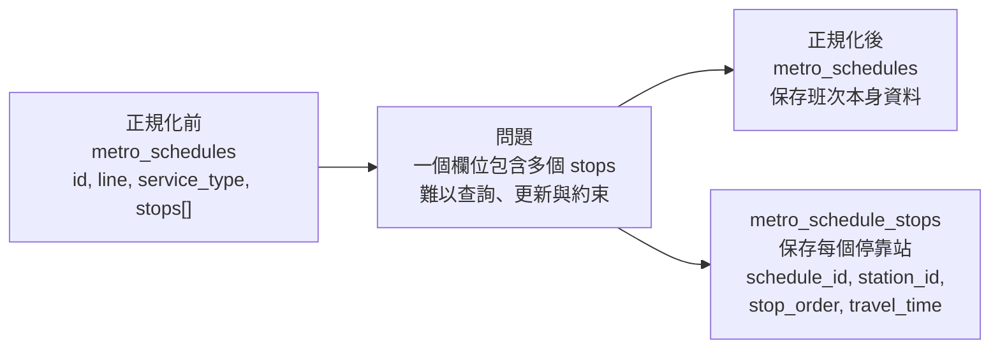
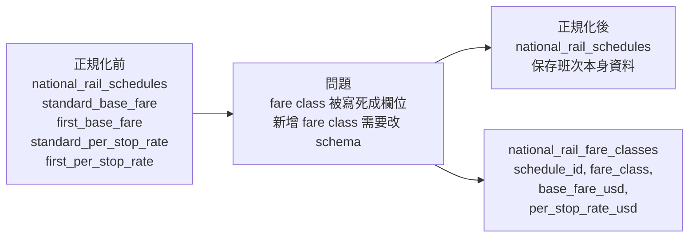
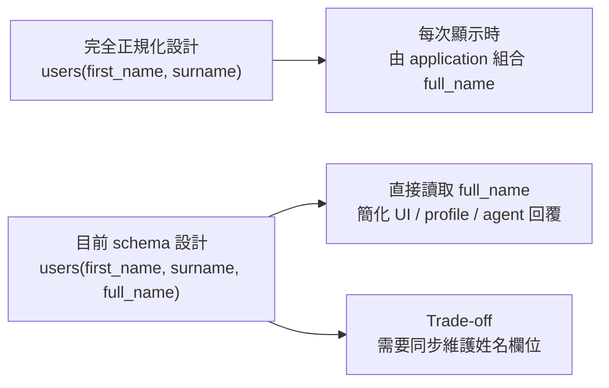
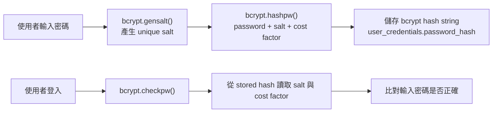

# Normalisation Justification

本系統的資料庫 schema 主要採用關聯式資料庫設計，用來儲存交通路線、車站、班次、停靠站、票種、使用者、訂票、付款與回饋等資料。由於系統中包含多種彼此相關的實體，例如一個班次會經過多個車站、一個使用者可以建立多筆訂票紀錄、一筆訂票可能對應付款或回饋資料，因此在設計資料表時，主要目標是將不同概念拆分成獨立且責任清楚的資料表，以減少資料重複並維持資料一致性。

在核心交易與交通資料的部分，本系統大多採用正規化設計。例如，車站資料、班次資料、班次停靠站資料、使用者基本資料、登入憑證資料、訂票資料與付款資料都分別存放在不同的資料表中。這樣的設計可以避免把多種不同性質的資料混在同一張表中，也能降低 update anomaly、insertion anomaly 與 deletion anomaly 發生的機會。例如，車站名稱或班次資訊若需要修改，只需要更新對應資料表中的單一資料來源，而不需要在多個重複欄位中逐一修改。

本系統尤其重視班次與停靠站之間的關係設計。由於一個 schedule 會包含多個 stops，而每個 stop 又具有自己的停靠順序與從起點出發後的累積時間，因此這些 stop-specific attributes 不適合直接以 array 或重複欄位的方式存放在 schedule table 中。相反地，本系統將 schedule stops 拆成獨立的 junction tables，使每一個停靠站都能以獨立 row 表示，並透過 foreign key 與 schedule、station 建立關聯。這是本 schema 中最主要的正規化設計決策之一，後續小節會進一步說明其 functional dependency 與 3NF 意義。

不過，本系統並不是在所有欄位上都追求完全理論化的正規化。對於部分資料量小、變動頻率低、且主要用於顯示或簡單查詢的欄位，例如 `full_name` 或部分 `TEXT[]` array 欄位，schema 中保留了一些實務上的簡化設計。這些設計屬於刻意的 de-normalisation trade-off，目的是在維持整體資料一致性的前提下，降低查詢與應用程式處理的複雜度。

因此，本節將依序說明本系統的主要正規化決策、刻意保留的反正規化取捨，以及使用者密碼儲存方式。說明重點會放在 schedule stops 拆表所達成的 3NF 設計、`users.full_name` 等欄位的實務取捨，以及 `user_credentials.password_hash` 使用 bcrypt 進行密碼雜湊的安全性考量。

---

## Section 1: 主要 3NF 設計決策

在關聯式資料庫設計中，normalisation 的目標是減少資料重複，並避免 update anomaly、insertion anomaly 與 deletion anomaly。一般來說，1NF 到 3NF 可以簡單理解如下：

| Normal Form | 核心概念                                                                   | 在本系統中的意義                                                               |
| ----------- | -------------------------------------------------------------------------- | ------------------------------------------------------------------------------ |
| **1NF**     | 欄位應保存單一、不可再分割的值，避免 repeating group                       | 不應該把一個 schedule 的所有 stops 塞進同一個欄位                              |
| **2NF**     | 非 key 欄位必須依賴整個 candidate key，而不是只依賴 composite key 的一部分 | 若 key 是 `(schedule_id, stop_order)`，stop 相關資料必須依賴整組 key           |
| **3NF**     | 非 key 欄位不應依賴其他非 key 欄位，避免 transitive dependency             | schedule table 只保存 schedule 本身資料，stop、fare class 等資料拆到各自資料表 |

本系統的 schema 中，以下兩個設計最能代表 3NF 的正規化決策：第一，是將 schedule stops 拆成獨立資料表；第二，是將 national rail 的 fare classes 拆成獨立資料表。這兩個設計都不是單純為了拆表，而是因為資料之間存在明確的 functional dependency。

### 1. Schedule stops 拆成獨立資料表

第一個主要 3NF 設計，是將班次停靠站資料拆成 `metro_schedule_stops` 與 `national_rail_schedule_stops`，而不是直接存在 `metro_schedules` 或 `national_rail_schedules` 裡。

一個 schedule 會經過多個 stations，而每個 stop 又有自己的 `stop_order` 和 `travel_time_from_origin_min`。這些資料不是 schedule 本身的單一屬性，而是 schedule 與 station 之間的有序關係。因此，本系統將每一個 stop 存成獨立 row。

#### 正規化前後差異

| 設計方式 | 可能的資料結構                                                                                                                            | 問題                                                                      |
| -------- | ----------------------------------------------------------------------------------------------------------------------------------------- | ------------------------------------------------------------------------- |
| 正規化前 | `metro_schedules(id, line, service_type, stops)`                                                                                          | `stops` 可能包含多個車站、順序、時間，形成 repeating group                |
| 正規化後 | `metro_schedules(id, line, service_type, ...)` + `metro_schedule_stops(schedule_id, station_id, stop_order, travel_time_from_origin_min)` | 每個 stop 是獨立 row，可查詢、更新、建立 foreign key 與 unique constraint |

可以用下面的方式理解：



以 `metro_schedule_stops` 為例，雖然資料表使用 `id` 作為 primary key，但 `(schedule_id, stop_order)` 也形成一組 alternate candidate key。因為在同一個 schedule 中，每一個停靠順序只能對應到一個 station。

其 functional dependency 可以表示為：

```text
(schedule_id, stop_order) → station_id, travel_time_from_origin_min
```

也就是說，只要知道某一個 schedule，以及該 schedule 中的第幾站，就能決定該站是哪一個 station，以及從起點到該站的累積行車時間。

這個設計達成的 normal form 是 **3NF**。因為 `station_id` 和 `travel_time_from_origin_min` 都直接依賴 candidate key `(schedule_id, stop_order)`，而不是依賴其他非 key 欄位。這樣可以避免將多個 stops 塞進同一欄位造成的 repeating group，也讓停靠站資料更容易查詢、更新與維護。

### 2. National rail fare classes 拆成獨立資料表

第二個 3NF 設計，是將 national rail 的票價等級資料拆成 `national_rail_fare_classes`，而不是直接把不同 fare class 的票價欄位放在 `national_rail_schedules` 裡。

在 national rail 中，同一個 schedule 可能有不同的 fare class，例如 `standard` 和 `first`。不同 fare class 會有不同的 `base_fare_usd` 和 `per_stop_rate_usd`。因此，票價資料不是只依賴 `schedule_id`，而是依賴 `schedule_id` 和 `fare_class` 的組合。

#### 正規化前後差異

| 設計方式 | 可能的資料結構                                                                                                                                   | 問題                                                                   |
| -------- | ------------------------------------------------------------------------------------------------------------------------------------------------ | ---------------------------------------------------------------------- |
| 正規化前 | `national_rail_schedules(id, line, standard_base_fare, first_base_fare, standard_per_stop_rate, first_per_stop_rate)`                            | 不同 fare class 被硬塞成多個欄位，新增票價等級時需要修改 table schema  |
| 正規化後 | `national_rail_schedules(id, line, service_type, ...)` + `national_rail_fare_classes(schedule_id, fare_class, base_fare_usd, per_stop_rate_usd)` | 每種 fare class 是獨立 row，結構更彈性，也避免 schedule table 過度膨脹 |

可以用下面的方式理解：



這個設計的 functional dependency 可以表示為：

```text
(schedule_id, fare_class) → base_fare_usd, per_stop_rate_usd
```

也就是說，只有同時知道是哪一個 schedule，以及是哪一種 fare class，才能決定該票種的基本票價與每站費率。

這個設計達成的 normal form 也是 **3NF**。因為 `base_fare_usd` 和 `per_stop_rate_usd` 都直接依賴 candidate key `(schedule_id, fare_class)`，而不是依賴其他非 key 欄位。如果把不同 fare class 的票價直接放在 `national_rail_schedules` 中，不但會造成欄位重複，也會讓 schedule table 同時負責班次資訊與票價規則，降低資料結構的彈性。

因此，將 fare class 拆成獨立資料表，可以讓 `national_rail_schedules` 專注於班次本身的資訊，而讓 `national_rail_fare_classes` 負責管理不同票價等級的 fare rules。這樣的設計減少了資料重複，也讓票價資料更符合 3NF 的設計。

---

## Section 2: 刻意的反正規化取捨

反正規化（de-normalisation）是指在資料庫設計中，刻意保留某些可以被推導出來的資料，或刻意不把所有資料都拆到最細的正規化結構中。這樣做通常會犧牲一部分資料純粹性，並可能帶來資料重複或 update anomaly 的風險。不過，在實務系統中，如果某些資料經常被讀取、很少被修改，或保留後可以明顯簡化查詢與應用程式邏輯，那麼適度的反正規化是可以接受的設計取捨。

### 1. `users.full_name`：為了顯示便利保留的衍生欄位

在本系統中，`users.full_name` 是一個刻意保留的 de-normalisation 設計。因為從資料意義來看，`full_name` 可以由 `first_name` 和 `surname` 組合產生。因此，在完全正規化的設計中，理論上可以只儲存 `first_name` 和 `surname`，並在需要顯示完整姓名時，再由 application layer 動態組合。

可以用以下方式理解這個 dependency：

```text
first_name, surname → full_name
```

也就是說，`full_name` 並不是完全獨立的新資料，而是可以由其他欄位推導出的衍生資料。因此，將 `full_name` 直接存入 `users` table 會產生一定程度的資料重複。

#### 正規化與反正規化設計比較

| 設計方式         | 資料結構                                | 優點                                              | 缺點                                                            |
| ---------------- | --------------------------------------- | ------------------------------------------------- | --------------------------------------------------------------- |
| 完全正規化設計   | `users(first_name, surname)`            | 避免重複資料，不會有姓名欄位不同步的問題          | 每次顯示完整姓名時，都需要重新組合                              |
| 目前 schema 設計 | `users(first_name, surname, full_name)` | UI、profile 查詢與 agent 回覆可以直接使用完整姓名 | 如果更新姓名時沒有同步更新 `full_name`，可能產生 update anomaly |

本系統選擇保留 `full_name`，主要是基於 simplicity rationale。使用者完整姓名是常見的顯示資料，例如在 user profile、booking record、payment record 或 agent 回覆中，都可能需要直接顯示使用者名稱。若每次都由 `first_name` 和 `surname` 動態組合，雖然更符合完全正規化，但會讓查詢結果與應用程式處理變得比較繁瑣。直接儲存 `full_name` 可以讓讀取端更簡單，也讓回傳資料更直觀。



這個設計的 trade-off 是，`full_name` 可能造成 update anomaly。例如，如果使用者修改 `first_name` 或 `surname`，但系統沒有同步更新 `full_name`，資料就會出現不一致。不過，在本系統中，使用者姓名並不是高頻率更新的資料，而且可以透過 application logic 在更新 profile 時同步維護 `first_name`、`surname` 和 `full_name`。因此，這個反正規化設計帶來的風險是可控的。

總結來說，`users.full_name` 是一個刻意的 de-normalisation choice。它犧牲了一小部分資料正規化程度，換取更簡單的查詢結果與顯示邏輯。由於完整姓名是常見但低變動的顯示資料，因此在本系統中保留 `full_name` 是合理的實務取捨。

---

## Section 3: Password Hashing Design

本系統在處理使用者登入資料時，不會直接儲存明文密碼，而是將密碼經過雜湊後，儲存在 `user_credentials.password_hash` 欄位中。同樣地，密保答案也不是以明文保存，而是經過相同方式處理後，儲存在 `user_credentials.secret_answer_hash`。這樣即使資料庫內容外洩，攻擊者也無法直接取得使用者的原始密碼或密保答案。

### 1. 密碼與驗證資料的儲存方式

在 schema 設計上，`users` table 主要保存使用者的基本資料，例如姓名、email、電話與生日；而登入驗證相關的敏感資料則被獨立放在 `user_credentials` table 中。這樣的設計可以讓 profile data 與 authentication data 分離，降低一般查詢使用者資料時意外暴露密碼雜湊資料的風險。

| 資料類型   | 儲存欄位                              | 儲存方式    | 說明                                     |
| ---------- | ------------------------------------- | ----------- | ---------------------------------------- |
| 使用者密碼 | `user_credentials.password_hash`      | bcrypt hash | 不儲存明文密碼                           |
| 密保答案   | `user_credentials.secret_answer_hash` | bcrypt hash | 密保答案也可用於身份驗證，因此也需要保護 |
| 密保問題   | `user_credentials.secret_question`    | plain text  | 問題本身不是秘密答案，主要用於提示使用者 |

在程式實作中，系統透過 `_hash_password()` 將使用者輸入的密碼轉換成 bcrypt hash，註冊時才寫入資料庫；登入時則透過 `_verify_password()` 比對使用者輸入的密碼與資料庫中保存的 hash 是否相符。因此，系統在任何時候都不需要把原始密碼存進資料庫。

### 2. 選擇 bcrypt 的原因

本系統選擇的 password hashing algorithm 是 **bcrypt**。bcrypt 是專門為 password hashing 設計的演算法，比 MD5 或 SHA-1 更適合用來儲存密碼。

MD5 和 SHA-1 是一般用途的雜湊函式，主要設計目標是快速計算資料摘要。這種「快速」在檢查檔案完整性時是優點，但在密碼儲存上反而是缺點。因為如果攻擊者取得資料庫中的 password hash，就可以用高速方式大量嘗試常見密碼，進行 brute-force attack 或 dictionary attack。

bcrypt 則不同。bcrypt 具有 **cost factor**，可以調整雜湊計算的成本，使每一次密碼猜測都需要更多計算時間。此外，bcrypt 也具有 **key stretching** 的效果，也就是透過重複計算增加每次密碼驗證的成本。這讓正常使用者登入時只會感受到很小的延遲，但對攻擊者來說，大量嘗試密碼會變得更昂貴、更不容易成功。

| 比較項目                | MD5 / SHA-1                | bcrypt                       |
| ----------------------- | -------------------------- | ---------------------------- |
| 原始用途                | 一般資料雜湊、完整性檢查   | 密碼雜湊                     |
| 計算速度                | 很快                       | 故意設計得較慢               |
| Cost factor             | 不支援                     | 支援，可調整計算成本         |
| Key stretching          | 不適合密碼儲存             | 透過重複計算提高猜密碼成本   |
| 面對 brute-force attack | 攻擊者可以高速嘗試大量密碼 | 每次嘗試成本較高，攻擊較困難 |

因此，本系統使用 bcrypt 的主要理由不是單純因為它「比較安全」，而是因為它的設計特性更符合 password storage 的需求。它可以透過 cost factor 和 key stretching 降低密碼被暴力破解的風險，這是 MD5 和 SHA-1 這類快速雜湊函式無法提供的保護。

### 3. Salt 管理與 rainbow-table 防護

本系統使用 bcrypt 時，salt 由 `bcrypt.gensalt()` 自動產生，並在 `bcrypt.hashpw()` 計算 hash 時一起使用。bcrypt 產生的最終 hash string 會包含演算法資訊、cost factor、salt 和 hash 結果，因此 schema 不需要另外建立獨立的 `salt` 欄位。

可以用以下流程理解：



salt 的主要作用，是讓相同密碼不會產生相同的 hash。例如，假設兩個使用者都使用相同密碼 `password123`，bcrypt 仍然會因為每次產生的 salt 不同，而得到不同的 `password_hash`。因此，攻擊者即使看到兩筆 hash，也無法直接判斷這兩個使用者是否使用相同密碼。

這也可以防止 rainbow-table attacks。Rainbow table 是攻擊者預先計算好的一大批「常見密碼 → hash」對照表。如果系統使用沒有 salt 的 MD5 或 SHA-1，常見密碼很容易被直接查表反推。但 bcrypt 為每個密碼加入不同 salt 後，即使原始密碼相同，最終 hash 也會不同。這使得攻擊者無法有效使用一張通用的 rainbow table 來查出使用者密碼。

### 4. 小結

總結來說，本系統在 password hashing 上採用 bcrypt，並將結果儲存在 `user_credentials.password_hash` 中。bcrypt 相較於 MD5 和 SHA-1，更適合密碼儲存，因為它支援 cost factor 與 key stretching，可以提高 brute-force attack 的成本。同時，bcrypt 會自動產生 salt，並將 salt embedded in hash string，使兩個相同密碼也會得到不同 hash，進而降低 rainbow-table attack 的風險。

---

## Section 4: Database Terminology and Schema Mapping

本節整理前面各 section 中使用到的資料庫術語，並將這些術語對應到本系統的實際 schema，說明本文件中的 normalisation、de-normalisation 與 schema design 討論，並非單純使用資料庫名詞，而是根據實際資料表、key constraint 與 functional dependency 進行分析，詳如下表:

### Terminology Mapping

| Term                        | Meaning                                                                                               | Example in this schema                                                                                                                                                                  |
| --------------------------- | ----------------------------------------------------------------------------------------------------- | --------------------------------------------------------------------------------------------------------------------------------------------------------------------------------------- |
| **Functional dependency**   | 某個欄位或欄位組合可以決定其他欄位，通常寫成 `A → B`                                                  | 在 `metro_schedule_stops` 中，`(schedule_id, stop_order) → station_id, travel_time_from_origin_min`                                                                                     |
| **Candidate key**           | 可以唯一識別一筆資料的最小欄位集合                                                                    | 在 `metro_schedule_stops` 中，`(schedule_id, stop_order)` 可以唯一識別同一個 schedule 中的某一站                                                                                        |
| **Primary key**             | 被實際選為資料表主鍵的 candidate key                                                                  | `metro_schedule_stops.id` 是該表實際使用的 primary key                                                                                                                                  |
| **Alternate candidate key** | 沒有被選為 primary key，但仍可以唯一識別資料列的 key                                                  | `(schedule_id, stop_order)` 透過 `UNIQUE` constraint 成為 alternate candidate key                                                                                                       |
| **Partial dependency**      | 在 composite key 中，非 key 欄位只依賴 key 的一部分，而不是依賴整個 key                               | 在 schedule stops 設計中，`station_id` 不應只依賴 `schedule_id`，而是要依賴完整的 `(schedule_id, stop_order)`                                                                           |
| **Transitive dependency**   | key 決定某個 non-key 欄位，而該 non-key 欄位又決定另一個 non-key 欄位，形成 `key → non-key → non-key` | 本系統沒有在 `metro_schedule_stops` 中重複保存 `station_name`，而是透過 `station_id` 連到 `metro_stations`，避免 `schedule stop → station_id → station_name` 這類 transitive dependency |
| **Junction table**          | 用來表示兩個 entity 之間關係的資料表，通常會包含兩邊的 foreign key                                    | `metro_schedule_stops` 連接 `metro_schedules` 與 `metro_stations`，表示某個 schedule 會停靠哪些 stations                                                                                |
| **De-normalisation**        | 刻意保留可推導資料，或不將資料拆到最細，以換取查詢或實作上的簡化                                      | `users.full_name` 可由 `first_name` 和 `surname` 推得，但仍被保留以簡化顯示與查詢                                                                                                       |
| **Update anomaly**          | 同一資訊重複保存時，如果更新不同步，可能造成資料不一致                                                | 如果修改 `users.first_name` 或 `users.surname`，但沒有同步更新 `users.full_name`，就可能產生姓名不一致                                                                                  |
