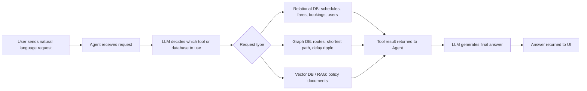
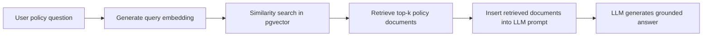

# Section 4 — Vector / RAG Design

本系統的 Vector / RAG 設計主要負責處理政策文件相關的自然語言查詢，例如退票規則、延誤補償、腳踏車規定等問題。這類資料通常不會是結構化的交易資料，而是以自然語言或JSON形式描述規則，因此不適合也幾乎無法使用關聯式資料庫。因此，為了使系統能理解使用者問題與政策文件間的語意關係，本系統使用PostgreSQL搭配 pgvector 建立向量資料庫，並透過 RAG pipeline 將相關政策內容提供給 LLM 作為回答依據。

---

## 4.1 what is embedded and why cosine similarity is appropriate for semantic search

### 4.1.1 what is embedded

本系統被嵌入成向量的資料是 **policy documents**，也就是政策文件。這些文件主要包含下列幾類資料：

| Policy document type     | Example content                                      |
| ------------------------ | ---------------------------------------------------- |
| Refund policies          | 退票規則、取消規則、延誤補償                         |
| Ticket type descriptions | single ticket、return ticket、day pass 等票種說明    |
| Booking rules            | 訂票、改票、兒童票、團體票、付款規則                 |
| Travel policies          | 行李、腳踏車、寵物、飲食、優先座、禁帶物品、乘車行為 |

這些資料之所以適合放入 Vector Database，是因為使用者通常不會完全使用政策文件中的原始詞彙發問。例如，政策文件中可能使用 “bicycle restrictions” 或 “cycle carriage rules”，但使用者可能問：

```text
Can I bring my bike on the metro?
```

這些句子在關鍵字上不太可能完全相同，但語意又高度相關。如果只使用 SQL 的 `LIKE` 或 exact keyword matching等方法，可能會因為用詞不同而查不到正確政策。然而，Embedding 則可以把文字轉換成高維度向量，使系統能根據語意相似度找出相關內容。

在資料建立階段，系統會將 policy documents 轉換成 embedding vectors，並存入 PostgreSQL 的 `policy_documents` table。這張表包含 `title`、`category`、`content`、`embedding`、`source_file` 與 `created_at` 等欄位，其中 `embedding` 欄位用來儲存政策文件的向量表示。schema 中也建立了 HNSW index，並使用 `vector_cosine_ops` 支援快速 cosine similarity search。

### 4.1.2 Why Cosine Similarity Is Appropriate

本系統使用 cosine similarity 進行 policy document retrieval，原因是 cosine similarity 很適合用於 embedding space 中的語意搜尋。

Cosine similarity 的重點不是比較兩個向量的長度，而是比較兩個向量的方向是否接近。換句話說，它是 **magnitude-independent** 的。即使兩個 embedding vector 的長度不同，只要它們在高維空間中的方向相似，cosine similarity 就會認為它們語意接近。

在 embedding space 中，向量方向可以視為文字語意的表示。若使用者問題與某份政策文件描述的是相同或相近的概念，它們的 embedding 應該會指向相近的方向。例如：

```text
User query:
Can I get compensation if my train is delayed?

Policy document:
Delay compensation is available when a national rail service is delayed by more than 30 minutes.
```

這兩段文字用詞不完全相同，但都與「train delay compensation」有關。因此，它們的 embedding 在語意空間中的方向應該接近。Cosine similarity 可以捕捉這種語意接近性，而不是只依賴表面字詞是否相同。

因此，cosine similarity 比單純關鍵字搜尋更適合本系統的政策查詢情境。它可以讓使用者用自然語言提出問題，系統再找出語意上最接近的政策文件。

---

## 4.2 Describes the full RAG pipeline: query embedding → similarity search → retrieved documents → LLM prompt → answer

### 4.2.1 Overall User Request Pipeline

說明 RAG pipeline 之前，先說明整個使用者請求從進入系統到回傳答案的完整流程。因為 RAG 並不是整個系統的全部流程，而是其中一個專門解決「政策文件語意檢索」問題的子流程。整體使用者請求流程如下：



當使用者送出自然語言問題時，系統首先由 agent 接收請求。Agent 會將使用者問題交給 LLM 判斷該呼叫哪一個工具或資料庫查詢。

在這個流程中，不同類型的問題會被導向不同資料庫：

| 使用者問題類型                                       | 使用的資料庫 / 模組   | 原因                                            |
| ---------------------------------------------------- | --------------------- | ----------------------------------------------- |
| 查詢班次、票價、座位、訂票紀錄                       | Relational Database   | 需要 exact match、join、constraint、transaction |
| 查詢最快路線、最短路徑、轉乘路線、延誤影響           | Graph Database        | 適合處理 node、relationship、path traversal     |
| 查詢退票政策、延誤補償、行李、寵物、腳踏車、票種規則 | Vector Database / RAG | 適合自然語言政策文件的語意搜尋                  |

因此，RAG pipeline 解決的是整體使用者請求流程中的這個環節：

> 當使用者問題屬於政策、規則、補償、乘車規範等自然語言文件查詢時，系統需要從 policy documents 中找出語意最相關的內容，並把這些內容提供給 LLM 作為回答依據。

## 4.2.2 RAG Pipeline

呈上，RAG pipeline 用於解決使用者請求流程中的政策文件查詢環節。當 agent 判斷使用者問題屬於 policy question 時，例如退票、延誤補償、行李、寵物、腳踏車、訂票規則或票種問題，LLM 會呼叫 `search_policy` tool，具體流程如下圖:



每步驟細節說明如次:

#### Stage 1: Query Embedding

第一步是將使用者的自然語言問題轉換成 query embedding。當使用者提出政策相關問題時，agent 會呼叫 `search_policy` tool。這個 tool 會使用目前設定的 embedding provider 將使用者問題轉成向量。

例如，使用者可能問：

```text
Can I bring my dog on the train?
```

系統會將這個問題轉換成一個高維度向量，儲存該問題的語意表示。然後，這個 query embedding 會被拿來與資料庫中已經儲存好的 policy document embeddings 做比較。

在程式中，`search_policy` 會先執行：

```python
embedding = llm.embed(params["query"])
```

接著再把這個 query embedding 傳入 vector search function。

#### Stage 2: Similarity Search

第二步是 similarity search。系統會將使用者問題的 query embedding 與 `policy_documents` table 中每一份政策文件的 embedding 進行 cosine distance / cosine similarity 比較。

本專案中，vector search 是由 `query_policy_vector_search()` 實作。這個 function 接收 query embedding，然後使用 pgvector 的 `<=>` operator 計算 cosine distance，再透過 `1 - distance` 轉換成 similarity score。SQL 查詢會篩選 similarity 大於 threshold 的文件，並根據距離由小到大排序，最後回傳 top-k 筆最相關的政策文件。

具體查詢邏輯如下：

```sql
SELECT title, category, content,
       1 - (embedding <=> query_vector) AS similarity
FROM policy_documents
WHERE similarity > threshold
ORDER BY embedding <=> query_vector
LIMIT top_k;
```

#### Stage 3: Retrieved Documents

第三步是取得 retrieved documents。Similarity search 完成後，系統會回傳 top-k 個最相關的 policy documents。根據設定檔，`VECTOR_TOP_K` 預設為 3，表示每次最多取回 3 筆最相關的政策文件；`VECTOR_SIMILARITY_THRESHOLD` 預設為 0.5，表示低於此相似度門檻的文件不會被回傳。

每一筆 retrieved document 通常包含：

| Field        | Meaning                                 |
| ------------ | --------------------------------------- |
| `title`      | 政策文件標題                            |
| `category`   | 政策類別，例如 refund、booking、conduct |
| `content`    | 政策文件內容                            |
| `similarity` | 與使用者問題的語意相似度分數            |

在 agent 中，`search_policy` 取得文件後，會整理每份文件的 title、category、content 與 similarity，並把文件內容截取一定長度後交給後續回答流程使用。

#### Stage 4: LLM Prompt with Retrieved Context

第四步是將 retrieved documents 放入 LLM prompt。
也就是retrieved documents 會成為 LLM 的 grounding context 這可以降低幻覺的風險，讓答案更準確。

例如，如果使用者問：

```text
My train was delayed by 45 minutes. Can I get a refund?
```

RAG pipeline 會先找出 delay compensation policy。然後 LLM 會根據 retrieved policy document 回答，而不是自己瞎猜補償規則。

#### Stage 5: Final Answer

最後，LLM 根據 retrieved documents 產生自然語言回答，並回傳給使用者。

綜上，RAG pipeline 在整體系統中扮演的角色可以總結為：

```text
User policy question
→ query embedding
→ vector similarity search
→ retrieve relevant policy documents
→ provide documents as context to LLM
→ generate grounded answer
```

---

可以，這兩段可以濃縮成下面這樣，語氣比較像設計文件中的說明，不會太長篇。

---

## 4.3 Embedding Dimension Choice

本系統的 embedding dimension 必須和 embedding provider 保持一致。專案主要支援兩種 embedding model：Ollama 的 `nomic-embed-text` 會產生 **768 維**向量，而 Gemini 的 `gemini-embedding-001` 會產生 **3072 維**向量。

本組一開始主要使用預設的 Ollama，因此 `policy_documents.embedding` 欄位設定為：

```sql
embedding vector(768)
```

不過在開發過程中，發現本地 1B 模型在 tool selection 上表現不夠力，工具很常選錯。為了確認問題是出在 query/tool 設計，還是模型太拉，過程中有切換成 Gemini API 進行測試。因為 Gemini embedding 是 3072 維，所以也需要同步把資料庫欄位改成：

```sql
embedding vector(3072)
```

簡單來說，embedding model 產生幾維向量，資料庫的 `vector(...)` 就必須設定成相同維度。

如果在 policy documents 已經 seeding 完之後才切換 embedding provider，不能只改 `.env` 中的LLM_PROVIDER，因為不同 provider 產生的向量維度不同。

例如，一開始用 Ollama seed，資料庫裡的 policy documents 都是 **768 維**向量；但後來切到 Gemini，新的使用者 query embedding 會變成 **3072 維**。這時候系統就會拿 3072 維的 query vector 去比對 768 維的 document vectors，造成 dimension mismatch。

所以切換 embedding provider時還要做這幾件事：

```text
修改 embedding dimension
→ 修改 schema.sql中的 vector(...) 維度
→ 重新執行 python skeleton/seed_vectors.py ，讓它產生新的向量
```

簡單說就是：**換 embedding model，就要同步換資料庫 vector 維度，並重新 seed。否則 query vector 和 document vector 維度不同，Vector search 就不能正常運作。**
