# Section 1 : ER Diagram for TransitFlow

本系統的 relational database 主要用來支援 TransitFlow 的結構化資料管理，包括車站、班次、停靠站順序、票價、座位、使用者、訂票紀錄、付款紀錄、回饋與退款政策等資料。整體 ERD 共使用 17 張主要 relational tables，分別涵蓋 Metro、National Rail、User/Auth、Transaction/Payment，以及 Refund Policy 等功能區塊。

為了讓 ERD 更清楚，本文件會先將資料表分成幾個區塊逐步呈現：

- Step 1：User / Auth 區
- Step 2：Metro 區
- Step 3：National Rail 區
- Step 4：Transaction / Payment 區
- Step 5： Refund Policy 區
- Step 6：整體 ERD 與跨分區關係

每個區塊內部的表關係最密集，先分區畫可以讓圖更清楚，避免一開始圖形過於複雜，難以評斷，最後一小節會將跨分區關係整合成完整 ERD，呈現統整結果並說明跨分區的關係。

## User / Auth section

### 1. Tables and Attributes

#### `users`

```text
users
- id PK
- user_id UK
- first_name
- surname
- full_name
- email UK
- phone
- date_of_birth
- is_active
- registered_at
- created_at
- updated_at
- is_deleted
```

#### `user_credentials`

```text
user_credentials
- id PK
- user_id FK, UK
- password_hash
- secret_question
- secret_answer_hash
- created_at
- updated_at
- is_deleted
```

### 2. Mermaid ERD

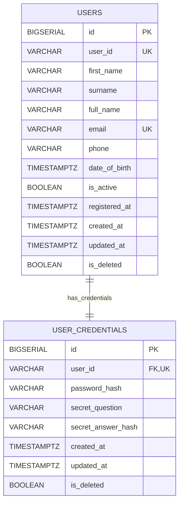

### 3. Relationship Explanation

#### User / Auth 區主要由 users 與 user_credentials 兩張表組成。

users 表儲存使用者基本資料，例如姓名、email、電話、生日、帳號狀態與註冊時間；user_credentials 表則儲存登入與帳號復原相關資料，例如 password_hash、secret_question 和 secret_answer_hash。這樣的設計讓使用者 profile 資料和認證資料分離，符合安全性與資料管理上的需求。

兩張表之間的關係是：

```text
users 1 ─── 1 user_credentials
```

在 Mermaid 圖中用：

```text
USERS ||--|| USER_CREDENTIALS : has_credentials
```

表示 1:1 relationship。

這個 cardinality 的依據是 user_credentials.user_id：

```sql
user_id VARCHAR(10) NOT NULL UNIQUE REFERENCES users(user_id) ON DELETE RESTRICT
```

其中：

| Constraint                  | 意義                                               |
| --------------------------- | -------------------------------------------------- |
| `REFERENCES users(user_id)` | 每一筆 credentials 必須對應到一個存在的 user       |
| `UNIQUE`                    | 同一個 user_id 最多只能出現在一筆 credentials 中   |
| `NOT NULL`                  | credentials 不能沒有 user                          |
| `ON DELETE RESTRICT`        | 如果 user 被 credentials 參照，不能直接刪除該 user |

## Metro section

### 1. Tables and Attributes

#### `metro_stations`

```text
metro_stations
- id PK
- station_id UK
- name
- lines
- is_interchange_metro
- interchange_metro_lines
- is_interchange_national_rail
- interchange_national_rail_station_id
- created_at
- updated_at
- is_deleted
```

#### `metro_schedules`

```text
metro_schedules
- id PK
- schedule_id UK
- line
- direction
- origin_station_id FK
- destination_station_id FK
- first_train_time
- last_train_time
- base_fare_usd
- per_stop_rate_usd
- frequency_min
- operates_on
- created_at
- updated_at
- is_deleted
```

#### `metro_schedule_stops`

```text
metro_schedule_stops
- id PK
- schedule_id FK
- station_id FK
- stop_order
- travel_time_from_origin_min
- created_at
- updated_at
- is_deleted
```

### 2. Mermaid ERD

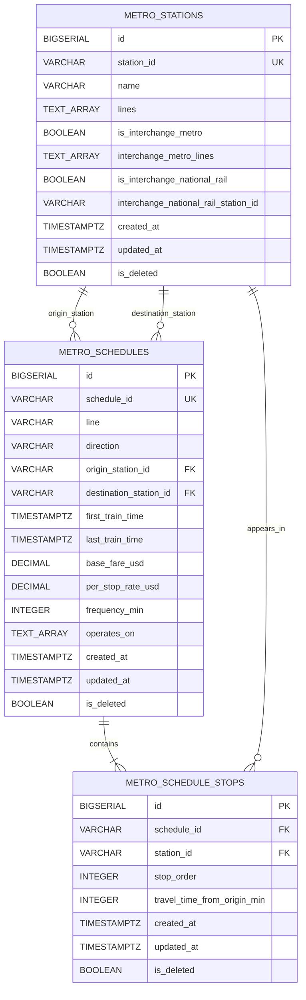

### 3. Relationship Explanation

Metro 區主要由 metro_stations、metro_schedules、metro_schedule_stops 三張表組成。

metro_stations 儲存 Metro 車站資料，例如 station id、站名、所屬路線，以及是否為 Metro 或 National Rail 的轉乘站。metro_schedules 儲存 Metro 班次與路線營運資訊，例如路線方向、起點站、終點站、首末班時間、票價與班距。metro_schedule_stops 則用來記錄每個 schedule 的停靠站順序，因此它是 metro_schedules 和 metro_stations 之間的 junction table。

#### metro_stations 與 metro_schedules

兩者之間有兩種關係：

metro_stations 1 ─── 0..N metro_schedules as origin_station
metro_stations 1 ─── 0..N metro_schedules as destination_station

在 Mermaid 圖中表示為：

```text
METRO_STATIONS ||--o{ METRO_SCHEDULES : origin_station
METRO_STATIONS ||--o{ METRO_SCHEDULES : destination_station
```

這代表一個 Metro station 可以作為 0 個或多個 schedule 的起點站，也可以作為 0 個或多個 schedule 的終點站；而每一個 schedule 都必須有一個起點站和一個終點站。

這個 cardinality 使用 o{，是因為 schema 只能保證每筆 metro_schedules 必須連到一個存在的 station，但不能保證每個 station 都一定會被某個 schedule 當作起點或終點。

這個關係的依據是 metro_schedules 中的兩個 FK：

```sql
origin_station_id VARCHAR(10) NOT NULL REFERENCES metro_stations(station_id) ON DELETE RESTRICT
destination_station_id VARCHAR(10) NOT NULL REFERENCES metro_stations(station_id) ON DELETE RESTRICT
```

其中：

| Constraint                              | 意義                                                  |
| --------------------------------------- | ----------------------------------------------------- |
| `REFERENCES metro_stations(station_id)` | schedule 的起點站與終點站必須存在於 metro_stations    |
| `NOT NULL`                              | 每個 schedule 都必須有起點站與終點站                  |
| `ON DELETE RESTRICT`                    | 如果 station 被 schedule 參照，不能直接刪除該 station |

因此，這裡是 1 : 0..N relationship。

#### metro_schedules 與 metro_schedule_stops

兩者之間的關係是：

```text
metro_schedules 1 ─── 1..N metro_schedule_stops
```

在 Mermaid 圖中表示為：

```text
METRO_SCHEDULES ||--|{ METRO_SCHEDULE_STOPS : contains
```

這代表在系統語意上，一個 Metro schedule 應包含 一個或多個 停靠站紀錄。每一筆 metro_schedule_stops 都必須屬於一個特定 schedule，並透過 stop_order 表示該站在路線中的順序。

這個 cardinality 使用 |{，是因為一個有效的 schedule 在 TransitFlow 的業務語意中不應該沒有停靠站。雖然 schema 的 FK 主要保證每筆 stop record 必須連到一個存在的 schedule，但 ERD 這裡用 1..N 來表達系統模型中 schedule 與 stops 的實際語意。

這個關係的依據是：

```sql
schedule_id VARCHAR(20) NOT NULL REFERENCES metro_schedules(schedule_id) ON DELETE RESTRICT
```

其中：

| Constraint                                | 意義                                                       |
| ----------------------------------------- | ---------------------------------------------------------- |
| `REFERENCES metro_schedules(schedule_id)` | 每筆 stop record 必須對應到一個存在的 schedule             |
| `NOT NULL`                                | 每筆 stop record 不能沒有 schedule                         |
| `ON DELETE RESTRICT`                      | 如果 schedule 被 stop record 參照，不能直接刪除該 schedule |

因此，這裡是 1 : 1..N relationship。

#### metro_stations 與 metro_schedule_stops

兩者之間的關係是：

```text
metro_stations 1 ─── 0..N metro_schedule_stops
```

在 Mermaid 圖中表示為：

```text
METRO_STATIONS ||--o{ METRO_SCHEDULE_STOPS : appears_in
```

這代表一個 Metro station 可以出現在 0 個或多個 schedule stops 中。例如同一個站可能出現在不同方向、不同路線或不同 schedule 裡。

這個 cardinality 使用 o{，是因為 schema 只能保證每筆 metro_schedule_stops 必須連到一個存在的 station，但不能保證每個 station 都一定會出現在某個 stop list 裡。換句話說，station 可以先存在於 station master table 中，但暫時沒有被任何 schedule 使用。

這個關係的依據是：

```sql
station_id VARCHAR(10) NOT NULL REFERENCES metro_stations(station_id) ON DELETE RESTRICT
```

其中：

| Constraint                              | 意義                                                     |
| --------------------------------------- | -------------------------------------------------------- |
| `REFERENCES metro_stations(station_id)` | 每筆 stop record 必須對應到一個存在的 station            |
| `NOT NULL`                              | 每筆 stop record 不能沒有 station                        |
| `ON DELETE RESTRICT`                    | 如果 station 被 stop record 參照，不能直接刪除該 station |

因此，這裡是 1 : 0..N relationship。

#### Metro schedule 與 station 的多對多概念

從概念上看，Metro schedule 和 Metro station 之間是多對多關係：

```text
一個 schedule 會經過多個 stations
一個 station 也可能出現在多個 schedules
```

但在 relational schema 中，這個 M:N relationship 被拆成：

```text
metro_schedules 1 ─── 1..N metro_schedule_stops
metro_stations 1 ─── 0..N metro_schedule_stops
```

也就是透過 metro_schedule_stops 這張 junction table 來表示。這樣可以清楚記錄停靠站順序 stop_order 和從起點出發的累積時間 travel_time_from_origin_min。

## National Rail section

### 1. Tables and Attributes

#### `national_rail_stations`

```text
national_rail_stations
- id PK
- station_id UK
- name
- lines
- is_interchange_national_rail
- interchange_national_rail_lines
- is_interchange_metro
- interchange_metro_station_id
- created_at
- updated_at
- is_deleted
```

#### `national_rail_schedules`

```text
national_rail_schedules
- id PK
- schedule_id UK
- line
- service_type
- direction
- origin_station_id FK
- destination_station_id FK
- first_train_time
- last_train_time
- frequency_min
- operates_on
- created_at
- updated_at
- is_deleted
```

#### `national_rail_schedule_stops`

```text
national_rail_schedule_stops
- id PK
- schedule_id FK
- station_id FK
- stop_order
- travel_time_from_origin_min
- created_at
- updated_at
- is_deleted
```

#### `national_rail_fare_classes`

```text
national_rail_fare_classes
- id PK
- schedule_id FK
- fare_class
- base_fare_usd
- per_stop_rate_usd
- created_at
- updated_at
- is_deleted
```

#### `seats`

```text
seats
- id PK
- schedule_id FK
- coach
- fare_class
- seat_id
- seat_row
- seat_column
- created_at
- updated_at
- is_deleted
```

### 2. Mermaid ERD

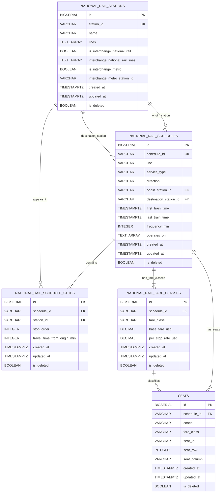

### 3. Relationship Explanation

National Rail 區主要由 national_rail_stations、national_rail_schedules、national_rail_schedule_stops、national_rail_fare_classes 與 seats 五張表組成。

national_rail_stations 儲存 National Rail 車站資料，例如 station id、站名、所屬路線，以及是否能與 Metro 或其他 National Rail line 轉乘。national_rail_schedules 儲存 National Rail 班次與營運資訊，例如路線、服務類型、方向、起點站、終點站、首末班時間與班距。national_rail_schedule_stops 用來記錄每個 schedule 的停靠站順序。national_rail_fare_classes 儲存不同 fare class 的票價規則，例如 standard 與 first class。seats 則儲存每個 schedule 的座位配置。

#### national_rail_stations 與 national_rail_schedules

兩者之間有兩種關係：

national_rail_stations 1 ─── 0..N national_rail_schedules as origin_station
national_rail_stations 1 ─── 0..N national_rail_schedules as destination_station

在 Mermaid 圖中表示為：

```text
NATIONAL_RAIL_STATIONS ||--o{ NATIONAL_RAIL_SCHEDULES : origin_station
NATIONAL_RAIL_STATIONS ||--o{ NATIONAL_RAIL_SCHEDULES : destination_station
```

這代表一個 National Rail station 可以作為 0 個或多個 schedule 的起點站，也可以作為 0 個或多個 schedule 的終點站；而每一個 schedule 都必須有一個起點站和一個終點站。

這個 cardinality 使用 o{，是因為 schema 只能保證每筆 national_rail_schedules 必須連到一個存在的 station，但不能保證每個 station 都一定會被某個 schedule 當作起點或終點。

這個關係的依據是 national_rail_schedules 中的兩個 FK：

```sql
origin_station_id VARCHAR(10) NOT NULL REFERENCES national_rail_stations(station_id) ON DELETE RESTRICT
destination_station_id VARCHAR(10) NOT NULL REFERENCES national_rail_stations(station_id) ON DELETE RESTRICT
```

其中：

| Constraint                                      | 意義                                                       |
| ----------------------------------------------- | ---------------------------------------------------------- |
| `REFERENCES national_rail_stations(station_id)` | schedule 的起點站與終點站必須存在於 national_rail_stations |
| `NOT NULL`                                      | 每個 schedule 都必須有起點站與終點站                       |
| `ON DELETE RESTRICT`                            | 如果 station 被 schedule 參照，不能直接刪除該 station      |

因此，這裡是 1 : 0..N relationship。

#### national_rail_schedules 與 national_rail_schedule_stops

兩者之間的關係是：

```text
national_rail_schedules 1 ─── 1..N national_rail_schedule_stops
```

在 Mermaid 圖中表示為：

```text
NATIONAL_RAIL_SCHEDULES ||--|{ NATIONAL_RAIL_SCHEDULE_STOPS : contains
```

這代表在系統語意上，一個 National Rail schedule 應包含 一個或多個 停靠站紀錄。每一筆 national_rail_schedule_stops 都必須屬於一個特定 schedule，並透過 stop_order 表示該站在路線中的順序。

這個 cardinality 使用 |{，是因為一個有效的 National Rail schedule 在 TransitFlow 的業務語意中不應該沒有停靠站。雖然 schema 的 FK 主要保證每筆 stop record 必須連到一個存在的 schedule，但 ERD 這裡用 1..N 來表達系統模型中 schedule 與 stops 的實際語意。

這個關係的依據是：

```sql
schedule_id VARCHAR(20) NOT NULL REFERENCES national_rail_schedules(schedule_id) ON DELETE RESTRICT
```

其中：

| Constraint                                        | 意義                                                       |
| ------------------------------------------------- | ---------------------------------------------------------- |
| `REFERENCES national_rail_schedules(schedule_id)` | 每筆 stop record 必須對應到一個存在的 schedule             |
| `NOT NULL`                                        | 每筆 stop record 不能沒有 schedule                         |
| `ON DELETE RESTRICT`                              | 如果 schedule 被 stop record 參照，不能直接刪除該 schedule |

因此，這裡是 1 : 1..N relationship。

#### national_rail_stations 與 national_rail_schedule_stops

兩者之間的關係是：

```text
national_rail_stations 1 ─── 0..N national_rail_schedule_stops
```

在 Mermaid 圖中表示為：

```text
NATIONAL_RAIL_STATIONS ||--o{ NATIONAL_RAIL_SCHEDULE_STOPS : appears_in
```

這代表一個 National Rail station 可以出現在 0 個或多個 schedule stops 中。例如同一個站可能出現在不同方向、不同路線或不同 service type 的 schedule 裡。

這個 cardinality 使用 o{，是因為 schema 只能保證每筆 national_rail_schedule_stops 必須連到一個存在的 station，但不能保證每個 station 都一定會出現在某個 stop list 裡。

這個關係的依據是：

```sql
station_id VARCHAR(10) NOT NULL REFERENCES national_rail_stations(station_id) ON DELETE RESTRICT
```

其中：

| Constraint                                      | 意義                                                     |
| ----------------------------------------------- | -------------------------------------------------------- |
| `REFERENCES national_rail_stations(station_id)` | 每筆 stop record 必須對應到一個存在的 station            |
| `NOT NULL`                                      | 每筆 stop record 不能沒有 station                        |
| `ON DELETE RESTRICT`                            | 如果 station 被 stop record 參照，不能直接刪除該 station |

因此，這裡是 1 : 0..N relationship。

#### national_rail_schedules 與 national_rail_fare_classes

兩者之間的關係是：

```text
national_rail_schedules 1 ─── 1..N national_rail_fare_classes
```

在 Mermaid 圖中表示為：

```text
NATIONAL_RAIL_SCHEDULES ||--|{ NATIONAL_RAIL_FARE_CLASSES : has_fare_classes
```

這代表在系統語意上，一個 National Rail schedule 應包含 一個或多個 fare class，例如 standard 或 first。每一筆 fare class record 都必須屬於一個特定 schedule，並儲存該 fare class 的 base fare 與 per-stop rate。

這個 cardinality 使用 |{，是因為一個可售票的 National Rail schedule 必須至少有一組票價規則。雖然 schema 的 FK 主要保證每筆 fare class 必須連到一個存在的 schedule，但 ERD 這裡用 1..N 來表達業務語意。

這個關係的依據是：

```sql
schedule_id VARCHAR(20) NOT NULL REFERENCES national_rail_schedules(schedule_id) ON DELETE RESTRICT
```

此外，schema 也透過：

```sql
UNIQUE (schedule_id, fare_class)
```

確保同一個 schedule 不會重複定義相同的 fare class。

因此，這裡是 1 : 1..N relationship。

#### national_rail_schedules 與 seats

兩者之間的關係是：

```text
national_rail_schedules 1 ─── 1..N seats
```

在 Mermaid 圖中表示為：

```text
NATIONAL_RAIL_SCHEDULES ||--|{ SEATS : has_seats
```

這代表在系統語意上，一個 National Rail schedule 應包含 一個或多個 seats。每一筆 seat record 都必須屬於一個特定 schedule，並記錄 coach、fare class、seat id、row 與 column。

這個 cardinality 使用 |{，是因為 National Rail booking 需要座位配置才能支援 seat selection 與 booking。雖然 schema 的 FK 主要保證每筆 seat 必須連到一個存在的 schedule，但 ERD 這裡用 1..N 表達業務語意。

這個關係的依據是：

```sql
schedule_id VARCHAR(20) NOT NULL REFERENCES national_rail_schedules(schedule_id) ON DELETE RESTRICT
```

此外，schema 也透過：

```sql
UNIQUE (schedule_id, seat_id)
UNIQUE (schedule_id, coach, seat_id, fare_class)
```

確保同一個 schedule 中的座位識別不會重複。

因此，這裡是 1 : 1..N relationship。

#### national_rail_fare_classes 與 seats

兩者之間的關係是：

```text
national_rail_fare_classes 1 ─── 0..N seats
```

在 Mermaid 圖中表示為：

```text
NATIONAL_RAIL_FARE_CLASSES ||--o{ SEATS : classifies
```

這代表一個 fare class 可以對應到 0 個或多個 seats，而每一個 seat 都屬於某個 fare class，例如 standard 或 first。

這個 cardinality 使用 o{，是因為 schema 中 seats.fare_class 只是 CHECK (fare_class IN ('standard', 'first'))，而 seats 主要透過 schedule_id FK 到 national_rail_schedules。在 bookings 表中有 composite FK 會同時參照 (schedule_id, fare_class)，但在 seats 表本身，fare_class 並不是直接宣告成 FK 到 national_rail_fare_classes。

因此，這條關係在 ERD 中主要是表達業務語意：seat 會依 fare class 分類，但其正式 FK 主要是 seats.schedule_id → national_rail_schedules.schedule_id。

## Transaction / Payment section

### 1. Tables and Attributes

#### `ticket_types`

```text
ticket_types
- id PK
- ticket_type UK
- display_name
- description
- available_on
- created_at
- updated_at
- is_deleted
```

#### `bookings`

```text
bookings
- id PK
- booking_id UK
- user_id FK
- schedule_id FK
- origin_station_id FK
- destination_station_id FK
- travel_date
- departure_time
- ticket_type FK
- fare_class
- coach
- seat_id
- stops_travelled
- amount_usd
- status
- booked_at
- travelled_at
- created_at
- updated_at
- is_deleted
```

#### `metro_travel_history`

```text
metro_travel_history
- id PK
- trip_id UK
- user_id FK
- schedule_id FK
- origin_station_id FK
- destination_station_id FK
- travel_date
- ticket_type FK
- day_pass_ref
- stops_travelled
- amount_usd
- status
- purchased_at
- travelled_at
- created_at
- updated_at
- is_deleted
```

#### `payments`

```text
payments
- id PK
- payment_id UK
- booking_id FK
- trip_id FK
- amount_usd
- method
- status
- paid_at
- created_at
- updated_at
- is_deleted
```

#### `feedbacks`

```text
feedbacks
- id PK
- feedback_id UK
- booking_id
- user_id FK
- rating
- comment
- submitted_at
- created_at
- updated_at
- is_deleted
```

### 2. Mermaid ERD

分兩張圖呈現：

(1) 第一張：Payment 相關

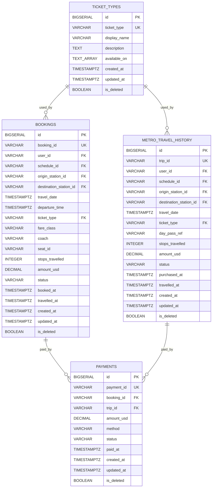

(2) 第二張：Feedback 相關

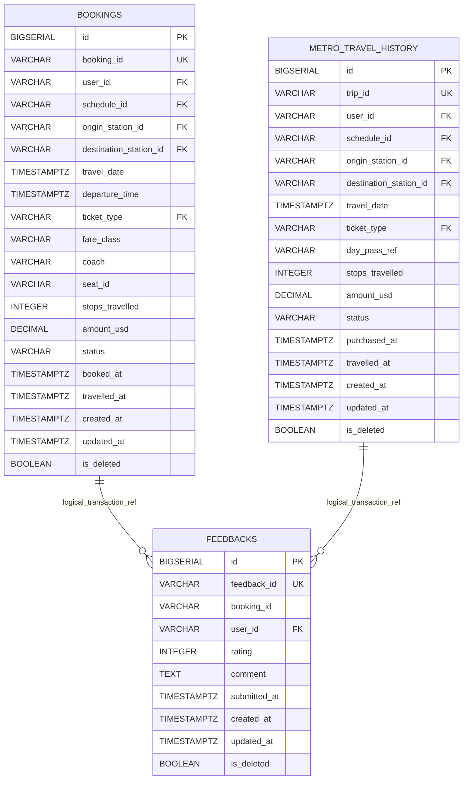

### 3. Relationship Explanation

Transaction / Payment 區主要由 ticket_types、bookings、metro_travel_history、payments 與 feedbacks 五張表組成。

ticket_types 儲存票種資料，例如 single、return、day pass 等。bookings 儲存 National Rail 的訂票紀錄，包括乘客、班次、起訖站、日期、座位、票價與狀態。metro_travel_history 儲存 Metro 的搭乘紀錄，包括使用者、班次、起訖站、票種、金額與狀態。payments 儲存付款紀錄，並可連到 National Rail booking 或 Metro trip。feedbacks 則儲存使用者對交易或旅程的評分與意見。

#### ticket_types 與 bookings

兩者之間的關係是：

```text
ticket_types 1 ─── 0..N bookings
```

在 Mermaid 圖中表示為：

```text
TICKET_TYPES ||--o{ BOOKINGS : used_by
```

這代表一種 ticket type 可以被 0 個或多個 National Rail bookings 使用；而每一筆 booking 都必須使用一種 ticket type。

這個 cardinality 使用 o{，是因為 schema 能保證每筆 bookings 必須連到一個存在的 ticket type，但不能保證每一種 ticket type 都一定會被 booking 使用。

這個關係的依據是 bookings.ticket_type：

```sql
ticket_type VARCHAR(20) NOT NULL DEFAULT 'single' REFERENCES ticket_types(ticket_type) ON DELETE RESTRICT
```

其中：

| Constraint                             | 意義                                                         |
| -------------------------------------- | ------------------------------------------------------------ |
| `REFERENCES ticket_types(ticket_type)` | 每筆 booking 的票種必須存在於 ticket_types                   |
| `NOT NULL`                             | 每筆 booking 都必須有 ticket type                            |
| `DEFAULT 'single'`                     | 若未指定票種，預設為 single                                  |
| `ON DELETE RESTRICT`                   | 如果 ticket type 被 booking 使用，不能直接刪除該 ticket type |

因此，這裡是 1 : 0..N relationship。

#### ticket_types 與 metro_travel_history

兩者之間的關係是：

```text
ticket_types 1 ─── 0..N metro_travel_history
```

在 Mermaid 圖中表示為：

```text
TICKET_TYPES ||--o{ METRO_TRAVEL_HISTORY : used_by
```

這代表一種 ticket type 可以被 0 個或多個 Metro travel records 使用；而每一筆 Metro travel record 都必須使用一種 ticket type。

這個 cardinality 使用 o{，是因為 schema 能保證每筆 metro_travel_history 必須連到一個存在的 ticket type，但不能保證每一種 ticket type 都一定會被 Metro trip 使用。

這個關係的依據是 metro_travel_history.ticket_type：

```sql
ticket_type VARCHAR(20) NOT NULL DEFAULT 'single' REFERENCES ticket_types(ticket_type) ON DELETE RESTRICT
```

其中：

| Constraint                             | 意義                                                            |
| -------------------------------------- | --------------------------------------------------------------- |
| `REFERENCES ticket_types(ticket_type)` | 每筆 Metro trip 的票種必須存在於 ticket_types                   |
| `NOT NULL`                             | 每筆 Metro trip 都必須有 ticket type                            |
| `DEFAULT 'single'`                     | 若未指定票種，預設為 single                                     |
| `ON DELETE RESTRICT`                   | 如果 ticket type 被 Metro trip 使用，不能直接刪除該 ticket type |

因此，這裡是 1 : 0..N relationship。

#### bookings 與 payments

兩者之間的關係是：

```text
bookings 1 ─── 0..N payments
```

在 Mermaid 圖中表示為：

```text
BOOKINGS ||--o{ PAYMENTS : paid_by
```

這代表一筆 National Rail booking 可以對應 0 個或多個 payment records；而當 payments.booking_id 不為 null 時，該 payment 必須連到一筆存在的 booking。

這個 cardinality 使用 o{，是因為目前 schema 有 payments.booking_id FK，但沒有對 booking_id 加上 UNIQUE constraint，因此在資料庫結構上允許同一筆 booking 對應多筆 payments。從系統語意上，通常一筆 booking 會有一筆 payment，但 ERD 這裡依照目前 schema 約束保守表達為 0..N。

這個關係的依據是 payments.booking_id：

```sql
booking_id VARCHAR(20) REFERENCES bookings(booking_id) ON DELETE RESTRICT
```

其中：

| Constraint                        | 意義                                                        |
| --------------------------------- | ----------------------------------------------------------- |
| `REFERENCES bookings(booking_id)` | payment 若指向 booking，該 booking 必須存在                 |
| `nullable`                        | payment 不一定是 National Rail booking，也可能是 Metro trip |
| `ON DELETE RESTRICT`              | 如果 booking 被 payment 參照，不能直接刪除該 booking        |

因此，這裡是 1 : 0..N relationship。

#### metro_travel_history 與 payments

兩者之間的關係是：

```text
metro_travel_history 1 ─── 0..N payments
```

在 Mermaid 圖中表示為：

```text
METRO_TRAVEL_HISTORY ||--o{ PAYMENTS : paid_by
```

這代表一筆 Metro trip 可以對應 0 個或多個 payment records；而當 payments.trip_id 不為 null 時，該 payment 必須連到一筆存在的 Metro travel record。

這個 cardinality 使用 o{，是因為目前 schema 有 payments.trip_id FK，但沒有對 trip_id 加上 UNIQUE constraint，因此在資料庫結構上允許同一筆 trip 對應多筆 payments。從系統語意上，通常一筆 trip 會有一筆 payment，但 ERD 這裡依照目前 schema 約束保守表達為 0..N。

這個關係的依據是 payments.trip_id：

```sql
trip_id VARCHAR(20) REFERENCES metro_travel_history(trip_id) ON DELETE RESTRICT
```

其中：

| Constraint                                 | 意義                                                        |
| ------------------------------------------ | ----------------------------------------------------------- |
| `REFERENCES metro_travel_history(trip_id)` | payment 若指向 Metro trip，該 trip 必須存在                 |
| `nullable`                                 | payment 不一定是 Metro trip，也可能是 National Rail booking |
| `ON DELETE RESTRICT`                       | 如果 trip 被 payment 參照，不能直接刪除該 trip              |

因此，這裡是 1 : 0..N relationship。

#### payments 的 booking / trip 二選一設計

payments 表可以連到 bookings 或 metro_travel_history，但不能同時連兩邊，也不能兩邊都沒有。

這個設計由以下 CHECK constraint 保證：

```sql
CHECK (
(booking_id IS NOT NULL AND trip_id IS NULL)
OR (booking_id IS NULL AND trip_id IS NOT NULL)
)
```

因此，每筆 payment 都必須屬於以下其中一種交易：

```text
National Rail booking payment
或
Metro trip payment
```

這讓 payments 可以同時支援兩種交通網路的付款紀錄，但仍避免同一筆 payment 同時指向兩種交易。

#### bookings 與 feedbacks

兩者之間的關係是：

```text
bookings 1 ─── 0..N feedbacks
```

在 Mermaid 圖中表示為：

```text
BOOKINGS ||--o{ FEEDBACKS : logical_transaction_ref
```

這代表一筆 National Rail booking 在業務語意上可以對應 0 個或多個 feedback records。不過需要注意，這條關係在目前 schema 中是 logical relationship，不是正式 FK。

原因是 feedbacks.booking_id：

booking_id VARCHAR(20) NOT NULL

目前沒有宣告：

REFERENCES bookings(booking_id)

因此，資料庫不會直接強制 feedbacks.booking_id 必須存在於 bookings。這個欄位主要是用來儲存交易 reference，例如 BKxxx 或 MTxxx。

所以這條線在 ERD 中是為了表達系統語意，而不是 strict database FK。

#### metro_travel_history 與 feedbacks

兩者之間的關係是：

```text
metro_travel_history 1 ─── 0..N feedbacks
```

在 Mermaid 圖中表示為：

```text
METRO_TRAVEL_HISTORY ||--o{ FEEDBACKS : logical_transaction_ref
```

這代表一筆 Metro trip 在業務語意上可以對應 0 個或多個 feedback records。不過和 National Rail booking 一樣，這條關係也是 logical relationship，不是正式 FK。

目前 feedbacks.booking_id 是一個共用 transaction reference 欄位，可能存放：

```text
BKxxx → National Rail booking
MTxxx → Metro trip
```

因此它可以在業務上連到 bookings 或 metro_travel_history，但 schema 沒有用 FK 強制這兩種關係。

#### Transaction / Payment 區的核心設計

這個區塊的核心設計說明如下：

```text
ticket_types 1 ─── 0..N bookings
ticket_types 1 ─── 0..N metro_travel_history
```

bookings 1 ─── 0..N payments
metro_travel_history 1 ─── 0..N payments

bookings 1 ─── 0..N feedbacks logical reference
metro_travel_history 1 ─── 0..N feedbacks logical reference

其中 bookings 負責 National Rail 訂票交易，metro_travel_history 負責 Metro 搭乘交易，payments 透過 booking_id 或 trip_id 支援兩種交易付款，而 feedbacks.booking_id 則以 logical transaction reference 的方式記錄使用者回饋所對應的交易。

## Refund Policy section

### 1. Tables and Attributes

#### `refund_policies`

```text
refund_policies
- id PK
- policy_id UK
- label
- network_type
- service_type
- notes
- created_at
- updated_at
- is_deleted
```

#### `refund_policy_windows`

```text
refund_policy_windows
- id PK
- policy_id FK
- window_id UK
- label
- condition_text
- hours_before_departure_min
- hours_before_departure_max
- refund_percent
- admin_fee_usd
- created_at
- updated_at
- is_deleted
```

### 2. Mermaid ERD

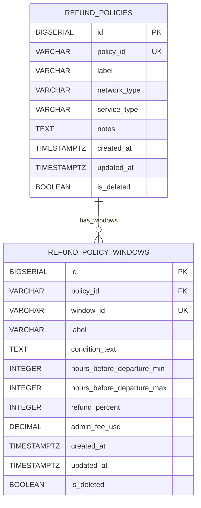

### 3. Relationship Explanation

#### Refund Policy 區主要由 refund_policies 與 refund_policy_windows 兩張表組成。

refund_policies 儲存退款政策的主資料，例如 policy id、政策名稱、適用網路類型、服務類型與補充說明。refund_policy_windows 則儲存每個政策下的退款時間區間，例如出發前多少小時取消、退款百分比與手續費。

#### refund_policies 與 refund_policy_windows

兩者之間的關係是：

```text
refund_policies 1 ─── 0..N refund_policy_windows
```

在 Mermaid 圖中表示為：

```text
REFUND_POLICIES ||--o{ REFUND_POLICY_WINDOWS : has_windows
```

這代表一個 refund policy 可以包含 0 個或多個 refund windows；而每一筆 refund window 都必須屬於一個特定 refund policy。

這個 cardinality 使用 o{，是因為 schema 能保證每筆 refund_policy_windows 必須連到一個存在的 refund_policies，但不能保證每個 refund policy 都一定會有 window。部分政策可能只是描述性規則，或不一定需要使用時間區間表示。

這個關係的依據是 refund_policy_windows.policy_id：

```sql
policy_id VARCHAR(20) NOT NULL REFERENCES refund_policies(policy_id) ON DELETE RESTRICT
```

其中：

| Constraint                              | 意義                                                     |
| --------------------------------------- | -------------------------------------------------------- |
| `REFERENCES refund_policies(policy_id)` | 每筆 refund window 必須對應到一個存在的 refund policy    |
| `NOT NULL`                              | 每筆 refund window 不能沒有 policy                       |
| `ON DELETE RESTRICT`                    | 如果 policy 被 refund window 參照，不能直接刪除該 policy |

此外，schema 也透過：

```sql
window_id VARCHAR(20) NOT NULL UNIQUE
```

確保每個 refund window 都有唯一識別碼。

因此，這裡是 1 : 0..N relationship。

#### Refund Policy 區的核心設計

這個區塊的核心設計說明如下：

```text
refund_policies 1 ─── 0..N refund_policy_windows
```

其中 refund_policies 是政策主表，用來描述退款政策適用的網路與服務類型；refund_policy_windows 是政策明細表，用來記錄不同時間條件下的退款比例與手續費。

這樣設計的好處是，一個政策可以拆成多個時間區間，例如出發前較早取消可以退款較高比例，接近出發時間取消則退款比例較低。這也讓 execute_cancellation() 這類取消訂票流程可以根據出發前剩餘時間，查詢對應的 refund window 並計算退款金額。

## Overall ERD and Cross-Partition Relationships

### 1. Overall Mermaid ERD

下圖整合前面各分區，共包含 17 張主要 relational tables。每張表只保留 PK、主要 FK，以及 2–3 個代表性欄位，避免整體圖過度擁擠。

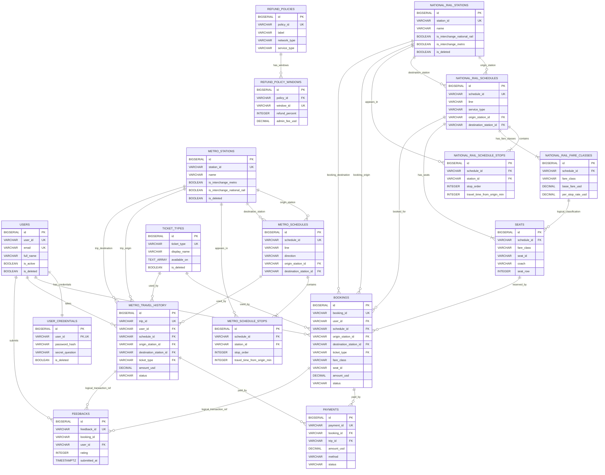

### 2. Cross-Partition Relationship Explanation

### A. users 與交易資料：bookings、metro_travel_history、feedbacks

users 會跨到 Transaction / Payment 區，分別連到 bookings、metro_travel_history 與 feedbacks：

users 1 ─── 0..N bookings
users 1 ─── 0..N metro_travel_history
users 1 ─── 0..N feedbacks

在 Mermaid 圖中表示為：

```text
USERS ||--o{ BOOKINGS : makes
USERS ||--o{ METRO_TRAVEL_HISTORY : takes
USERS ||--o{ FEEDBACKS : submits
```

這代表一位使用者可以建立 0 個或多個 National Rail bookings，也可以有 0 個或多個 Metro trip records，並提交 0 個或多個 feedbacks；而每一筆 booking、trip 或 feedback 都必須對應到一位存在的 user。

這些關係的依據是：

```sql
bookings.user_id REFERENCES users(user_id)
metro_travel_history.user_id REFERENCES users(user_id)
feedbacks.user_id REFERENCES users(user_id)
```

其中 user_id 都是外鍵，因此這些跨分區關係是正式 FK relationship。

### B. Metro 區與 Transaction 區：metro_schedules / metro_stations 與 metro_travel_history

Metro 的路線資料會跨到交易區，連到 metro_travel_history：

metro_schedules 1 ─── 0..N metro_travel_history
metro_stations 1 ─── 0..N metro_travel_history as trip_origin
metro_stations 1 ─── 0..N metro_travel_history as trip_destination

在 Mermaid 圖中表示為：

```text
METRO_SCHEDULES ||--o{ METRO_TRAVEL_HISTORY : used_by
METRO_STATIONS ||--o{ METRO_TRAVEL_HISTORY : trip_origin
METRO_STATIONS ||--o{ METRO_TRAVEL_HISTORY : trip_destination
```

這代表一條 Metro schedule 可以被 0 個或多個 trip records 使用；一個 Metro station 也可以作為 0 個或多個 Metro trips 的起點站或終點站。

這些關係的依據是 metro_travel_history 中的 FK：

```sql
schedule_id REFERENCES metro_schedules(schedule_id)
origin_station_id REFERENCES metro_stations(station_id)
destination_station_id REFERENCES metro_stations(station_id)
```

因此這些跨分區關係都是正式 FK，而且反映了 Metro 交易紀錄必須建立在既有 route/schedule/station 資料上。

### C. National Rail 區與 Transaction 區：national_rail_schedules / national_rail_stations / seats 與 bookings

National Rail 的路線與座位資料會跨到交易區，連到 bookings：

national_rail_schedules 1 ─── 0..N bookings
national_rail_stations 1 ─── 0..N bookings as booking_origin
national_rail_stations 1 ─── 0..N bookings as booking_destination
seats 1 ─── 0..N bookings

在 Mermaid 圖中表示為：

```text
NATIONAL_RAIL_SCHEDULES ||--o{ BOOKINGS : booked_for
NATIONAL_RAIL_STATIONS ||--o{ BOOKINGS : booking_origin
NATIONAL_RAIL_STATIONS ||--o{ BOOKINGS : booking_destination
SEATS ||--o{ BOOKINGS : reserved_by
```

這代表一條 National Rail schedule 可以對應 0 個或多個 bookings；一個 station 可以作為 0 個或多個 bookings 的起點或終點；一個 seat 在不同 travel dates / transactions 下，也可能出現在 0 個或多個 bookings 中。

這些關係的依據是 bookings 中的正式 FK：

```sql
schedule_id REFERENCES national_rail_schedules(schedule_id)
origin_station_id REFERENCES national_rail_stations(station_id)
destination_station_id REFERENCES national_rail_stations(station_id)
ticket_type REFERENCES ticket_types(ticket_type)
```

另外，bookings 與 seats 的關係是靠 composite seat identification 支撐，屬於 National Rail booking 的核心設計。

### D. ticket_types 與 bookings / metro_travel_history

ticket_types 位於 Transaction / Payment 區內，但同時被 National Rail booking 與 Metro trip 共用：

ticket_types 1 ─── 0..N bookings
ticket_types 1 ─── 0..N metro_travel_history

在 Mermaid 圖中表示為：

```text
TICKET_TYPES ||--o{ BOOKINGS : used_by
TICKET_TYPES ||--o{ METRO_TRAVEL_HISTORY : used_by
```

這代表一種 ticket type 可以被 0 個或多個 bookings 或 Metro trip records 使用；而每筆 booking / trip 都必須使用一種存在的票種。

這些關係的依據是：

```sql
bookings.ticket_type REFERENCES ticket_types(ticket_type)
metro_travel_history.ticket_type REFERENCES ticket_types(ticket_type)
```

這是整體系統中一個很重要的跨模組設計：同一張 ticket_types 表同時支援 National Rail 與 Metro 的交易資料。

### E. feedbacks 與 bookings / metro_travel_history：邏輯關聯而非正式 FK

#### feedbacks 會跨到 National Rail booking 與 Metro trip，但這裡要特別說明：

bookings 1 ─── 0..N feedbacks
metro_travel_history 1 ─── 0..N feedbacks

在 Mermaid 圖中表示為：

```text
BOOKINGS ||--o{ FEEDBACKS : logical_transaction_ref
METRO_TRAVEL_HISTORY ||--o{ FEEDBACKS : logical_transaction_ref
```

這兩條線用來表達 系統語意上的關聯，也就是 feedback 會對應到一筆既有交易；但在目前 schema 中，feedbacks.booking_id 並沒有正式宣告成 FK 到 bookings(booking_id) 或 metro_travel_history(trip_id)。

也就是說：

這是 logical relationship

不是 strict database FK relationship

feedbacks.booking_id 主要儲存交易參照，例如：

BKxxx → National Rail booking
MTxxx → Metro trip

因此在整體 ERD 中仍然把這條關係畫出來，能更完整反映系統資料流。

### F. Refund Policy 區目前沒有正式跨分區 FK

#### refund_policies 與 refund_policy_windows 本身形成：

refund_policies 1 ─── 0..N refund_policy_windows

但在目前 schema 中，它們沒有再以 FK 直接連到 booking、payment 或 schedule 等其他分區表。因此在整體 ERD 中，Refund Policy 區是獨立存在的。

但這不代表它沒有系統意義，而是表示：

它主要由 application logic 使用

例如 execute_cancellation() 會根據 policy / window 規則去計算退款金額

但資料表層級沒有直接宣告跨分區 FK

### 3. Summary of Cross-Partition Links

整體來說，跨分區關係可以整理成以下幾組核心連結：

```text
User / Auth → Transaction
Metro → Metro Travel History
National Rail → Bookings
Ticket Types → Bookings / Metro Travel History
Feedbacks → Bookings / Metro Travel History (logical relationship)
Refund Policy → currently standalone in schema
```

# Section 2 : Normalisation Justification

本系統的資料庫 schema 主要採用關聯式資料庫設計，用來儲存交通路線、車站、班次、停靠站、票種、使用者、訂票、付款與回饋等資料。由於系統中包含多種彼此相關的實體，例如一個班次會經過多個車站、一個使用者可以建立多筆訂票紀錄、一筆訂票可能對應付款或回饋資料，因此在設計資料表時，主要目標是將不同概念拆分成獨立且責任清楚的資料表，以減少資料重複並維持資料一致性。

在核心交易與交通資料的部分，本系統大多採用正規化設計。例如，車站資料、班次資料、班次停靠站資料、使用者基本資料、登入憑證資料、訂票資料與付款資料都分別存放在不同的資料表中。這樣的設計可以避免把多種不同性質的資料混在同一張表中，也能降低 update anomaly、insertion anomaly 與 deletion anomaly 發生的機會。例如，車站名稱或班次資訊若需要修改，只需要更新對應資料表中的單一資料來源，而不需要在多個重複欄位中逐一修改。

本系統尤其重視班次與停靠站之間的關係設計。由於一個 schedule 會包含多個 stops，而每個 stop 又具有自己的停靠順序與從起點出發後的累積時間，因此這些 stop-specific attributes 不適合直接以 array 或重複欄位的方式存放在 schedule table 中。相反地，本系統將 schedule stops 拆成獨立的 junction tables，使每一個停靠站都能以獨立 row 表示，並透過 foreign key 與 schedule、station 建立關聯。這是本 schema 中最主要的正規化設計決策之一，後續小節會進一步說明其 functional dependency 與 3NF 意義。

不過，本系統並不是在所有欄位上都追求完全理論化的正規化。對於部分資料量小、變動頻率低、且主要用於顯示或簡單查詢的欄位，例如 `full_name` 或部分 `TEXT[]` array 欄位，schema 中保留了一些實務上的簡化設計。這些設計屬於刻意的 de-normalisation trade-off，目的是在維持整體資料一致性的前提下，降低查詢與應用程式處理的複雜度。

因此，本節將依序說明本系統的主要正規化決策、刻意保留的反正規化取捨，以及使用者密碼儲存方式。說明重點會放在 schedule stops 拆表所達成的 3NF 設計、`users.full_name` 等欄位的實務取捨，以及 `user_credentials.password_hash` 使用 bcrypt 進行密碼雜湊的安全性考量。

---

## 1. 主要 3NF 設計決策

在關聯式資料庫設計中，normalisation 的目標是減少資料重複，並避免 update anomaly、insertion anomaly 與 deletion anomaly。一般來說，1NF 到 3NF 可以簡單理解如下：

| Normal Form | 核心概念                                                                   | 在本系統中的意義                                                               |
| ----------- | -------------------------------------------------------------------------- | ------------------------------------------------------------------------------ |
| **1NF**     | 欄位應保存單一、不可再分割的值，避免 repeating group                       | 不應該把一個 schedule 的所有 stops 塞進同一個欄位                              |
| **2NF**     | 非 key 欄位必須依賴整個 candidate key，而不是只依賴 composite key 的一部分 | 若 key 是 `(schedule_id, stop_order)`，stop 相關資料必須依賴整組 key           |
| **3NF**     | 非 key 欄位不應依賴其他非 key 欄位，避免 transitive dependency             | schedule table 只保存 schedule 本身資料，stop、fare class 等資料拆到各自資料表 |

本系統的 schema 中，以下兩個設計最能代表 3NF 的正規化決策：第一，是將 schedule stops 拆成獨立資料表；第二，是將 national rail 的 fare classes 拆成獨立資料表。這兩個設計都不是單純為了拆表，而是因為資料之間存在明確的 functional dependency。

### 1.1 Schedule stops 拆成獨立資料表

第一個主要 3NF 設計，是將班次停靠站資料拆成 `metro_schedule_stops` 與 `national_rail_schedule_stops`，而不是直接存在 `metro_schedules` 或 `national_rail_schedules` 裡。

一個 schedule 會經過多個 stations，而每個 stop 又有自己的 `stop_order` 和 `travel_time_from_origin_min`。這些資料不是 schedule 本身的單一屬性，而是 schedule 與 station 之間的有序關係。因此，本系統將每一個 stop 存成獨立 row。

#### 正規化前後差異

| 設計方式 | 可能的資料結構                                                                                                                            | 問題                                                                      |
| -------- | ----------------------------------------------------------------------------------------------------------------------------------------- | ------------------------------------------------------------------------- |
| 正規化前 | `metro_schedules(id, line, service_type, stops)`                                                                                          | `stops` 可能包含多個車站、順序、時間，形成 repeating group                |
| 正規化後 | `metro_schedules(id, line, service_type, ...)` + `metro_schedule_stops(schedule_id, station_id, stop_order, travel_time_from_origin_min)` | 每個 stop 是獨立 row，可查詢、更新、建立 foreign key 與 unique constraint |

可以用下面的方式理解：

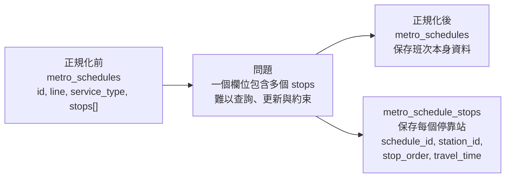

以 `metro_schedule_stops` 為例，雖然資料表使用 `id` 作為 primary key，但 `(schedule_id, stop_order)` 也形成一組 alternate candidate key。因為在同一個 schedule 中，每一個停靠順序只能對應到一個 station。

其 functional dependency 可以表示為：

```text
(schedule_id, stop_order) → station_id, travel_time_from_origin_min
```

也就是說，只要知道某一個 schedule，以及該 schedule 中的第幾站，就能決定該站是哪一個 station，以及從起點到該站的累積行車時間。

這個設計達成的 normal form 是 **3NF**。因為 `station_id` 和 `travel_time_from_origin_min` 都直接依賴 candidate key `(schedule_id, stop_order)`，而不是依賴其他非 key 欄位。這樣可以避免將多個 stops 塞進同一欄位造成的 repeating group，也讓停靠站資料更容易查詢、更新與維護。

### 1.2 National rail fare classes 拆成獨立資料表

第二個 3NF 設計，是將 national rail 的票價等級資料拆成 `national_rail_fare_classes`，而不是直接把不同 fare class 的票價欄位放在 `national_rail_schedules` 裡。

在 national rail 中，同一個 schedule 可能有不同的 fare class，例如 `standard` 和 `first`。不同 fare class 會有不同的 `base_fare_usd` 和 `per_stop_rate_usd`。因此，票價資料不是只依賴 `schedule_id`，而是依賴 `schedule_id` 和 `fare_class` 的組合。

#### 正規化前後差異

| 設計方式 | 可能的資料結構                                                                                                                                   | 問題                                                                   |
| -------- | ------------------------------------------------------------------------------------------------------------------------------------------------ | ---------------------------------------------------------------------- |
| 正規化前 | `national_rail_schedules(id, line, standard_base_fare, first_base_fare, standard_per_stop_rate, first_per_stop_rate)`                            | 不同 fare class 被硬塞成多個欄位，新增票價等級時需要修改 table schema  |
| 正規化後 | `national_rail_schedules(id, line, service_type, ...)` + `national_rail_fare_classes(schedule_id, fare_class, base_fare_usd, per_stop_rate_usd)` | 每種 fare class 是獨立 row，結構更彈性，也避免 schedule table 過度膨脹 |

可以用下面的方式理解：

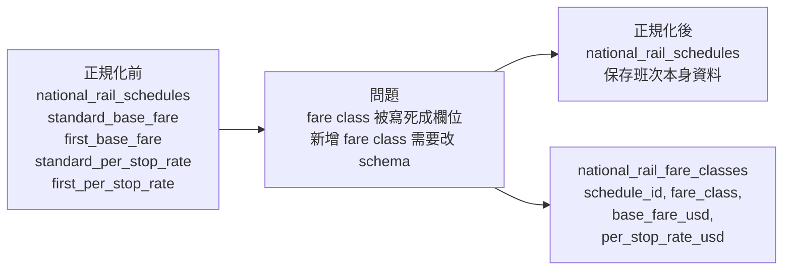

這個設計的 functional dependency 可以表示為：

```text
(schedule_id, fare_class) → base_fare_usd, per_stop_rate_usd
```

也就是說，只有同時知道是哪一個 schedule，以及是哪一種 fare class，才能決定該票種的基本票價與每站費率。

這個設計達成的 normal form 也是 **3NF**。因為 `base_fare_usd` 和 `per_stop_rate_usd` 都直接依賴 candidate key `(schedule_id, fare_class)`，而不是依賴其他非 key 欄位。如果把不同 fare class 的票價直接放在 `national_rail_schedules` 中，不但會造成欄位重複，也會讓 schedule table 同時負責班次資訊與票價規則，降低資料結構的彈性。

因此，將 fare class 拆成獨立資料表，可以讓 `national_rail_schedules` 專注於班次本身的資訊，而讓 `national_rail_fare_classes` 負責管理不同票價等級的 fare rules。這樣的設計減少了資料重複，也讓票價資料更符合 3NF 的設計。

---

## 2. 刻意的反正規化取捨

反正規化（de-normalisation）是指在資料庫設計中，刻意保留某些可以被推導出來的資料，或刻意不把所有資料都拆到最細的正規化結構中。這樣做通常會犧牲一部分資料純粹性，並可能帶來資料重複或 update anomaly 的風險。不過，在實務系統中，如果某些資料經常被讀取、很少被修改，或保留後可以明顯簡化查詢與應用程式邏輯，那麼適度的反正規化是可以接受的設計取捨。

### users.full_name`：為了顯示便利保留的衍生欄位

在本系統中，`users.full_name` 是一個刻意保留的 de-normalisation 設計。因為從資料意義來看，`full_name` 可以由 `first_name` 和 `surname` 組合產生。因此，在完全正規化的設計中，理論上可以只儲存 `first_name` 和 `surname`，並在需要顯示完整姓名時，再由 application layer 動態組合。

可以用以下方式理解這個 dependency：

```text
first_name, surname → full_name
```

也就是說，`full_name` 並不是完全獨立的新資料，而是可以由其他欄位推導出的衍生資料。因此，將 `full_name` 直接存入 `users` table 會產生一定程度的資料重複。

#### 正規化與反正規化設計比較

| 設計方式         | 資料結構                                | 優點                                              | 缺點                                                            |
| ---------------- | --------------------------------------- | ------------------------------------------------- | --------------------------------------------------------------- |
| 完全正規化設計   | `users(first_name, surname)`            | 避免重複資料，不會有姓名欄位不同步的問題          | 每次顯示完整姓名時，都需要重新組合                              |
| 目前 schema 設計 | `users(first_name, surname, full_name)` | UI、profile 查詢與 agent 回覆可以直接使用完整姓名 | 如果更新姓名時沒有同步更新 `full_name`，可能產生 update anomaly |

本系統選擇保留 `full_name`，主要是基於 simplicity rationale。使用者完整姓名是常見的顯示資料，例如在 user profile、booking record、payment record 或 agent 回覆中，都可能需要直接顯示使用者名稱。若每次都由 `first_name` 和 `surname` 動態組合，雖然更符合完全正規化，但會讓查詢結果與應用程式處理變得比較繁瑣。直接儲存 `full_name` 可以讓讀取端更簡單，也讓回傳資料更直觀。

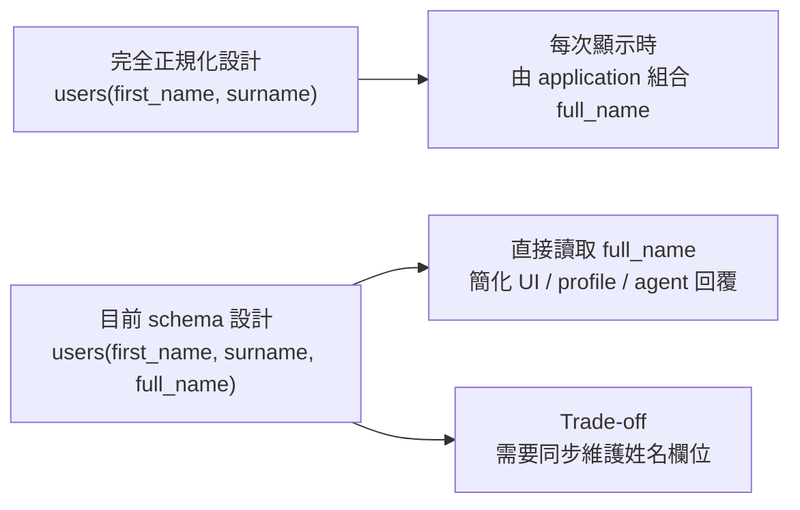

這個設計的 trade-off 是，`full_name` 可能造成 update anomaly。例如，如果使用者修改 `first_name` 或 `surname`，但系統沒有同步更新 `full_name`，資料就會出現不一致。不過，在本系統中，使用者姓名並不是高頻率更新的資料，而且可以透過 application logic 在更新 profile 時同步維護 `first_name`、`surname` 和 `full_name`。因此，這個反正規化設計帶來的風險是可控的。

總結來說，`users.full_name` 是一個刻意的 de-normalisation choice。它犧牲了一小部分資料正規化程度，換取更簡單的查詢結果與顯示邏輯。由於完整姓名是常見但低變動的顯示資料，因此在本系統中保留 `full_name` 是合理的實務取捨。

---

## 3. Password Hashing Design

本系統在處理使用者登入資料時，不會直接儲存明文密碼，而是將密碼經過雜湊後，儲存在 `user_credentials.password_hash` 欄位中。同樣地，密保答案也不是以明文保存，而是經過相同方式處理後，儲存在 `user_credentials.secret_answer_hash`。這樣即使資料庫內容外洩，攻擊者也無法直接取得使用者的原始密碼或密保答案。

### 3.1 密碼與驗證資料的儲存方式

在 schema 設計上，`users` table 主要保存使用者的基本資料，例如姓名、email、電話與生日；而登入驗證相關的敏感資料則被獨立放在 `user_credentials` table 中。這樣的設計可以讓 profile data 與 authentication data 分離，降低一般查詢使用者資料時意外暴露密碼雜湊資料的風險。

| 資料類型   | 儲存欄位                              | 儲存方式    | 說明                                     |
| ---------- | ------------------------------------- | ----------- | ---------------------------------------- |
| 使用者密碼 | `user_credentials.password_hash`      | bcrypt hash | 不儲存明文密碼                           |
| 密保答案   | `user_credentials.secret_answer_hash` | bcrypt hash | 密保答案也可用於身份驗證，因此也需要保護 |
| 密保問題   | `user_credentials.secret_question`    | plain text  | 問題本身不是秘密答案，主要用於提示使用者 |

在程式實作中，系統透過 `_hash_password()` 將使用者輸入的密碼轉換成 bcrypt hash，註冊時才寫入資料庫；登入時則透過 `_verify_password()` 比對使用者輸入的密碼與資料庫中保存的 hash 是否相符。因此，系統在任何時候都不需要把原始密碼存進資料庫。

### 3.2 選擇 bcrypt 的原因

本系統選擇的 password hashing algorithm 是 **bcrypt**。bcrypt 是專門為 password hashing 設計的演算法，比 MD5 或 SHA-1 更適合用來儲存密碼。

MD5 和 SHA-1 是一般用途的雜湊函式，主要設計目標是快速計算資料摘要。這種「快速」在檢查檔案完整性時是優點，但在密碼儲存上反而是缺點。因為如果攻擊者取得資料庫中的 password hash，就可以用高速方式大量嘗試常見密碼，進行 brute-force attack 或 dictionary attack。

bcrypt 則不同。bcrypt 具有 **cost factor**，可以調整雜湊計算的成本，使每一次密碼猜測都需要更多計算時間。此外，bcrypt 也具有 **key stretching** 的效果，也就是透過重複計算增加每次密碼驗證的成本。這讓正常使用者登入時只會感受到很小的延遲，但對攻擊者來說，大量嘗試密碼會變得更昂貴、更不容易成功。

| 比較項目                | MD5 / SHA-1                | bcrypt                       |
| ----------------------- | -------------------------- | ---------------------------- |
| 原始用途                | 一般資料雜湊、完整性檢查   | 密碼雜湊                     |
| 計算速度                | 很快                       | 故意設計得較慢               |
| Cost factor             | 不支援                     | 支援，可調整計算成本         |
| Key stretching          | 不適合密碼儲存             | 透過重複計算提高猜密碼成本   |
| 面對 brute-force attack | 攻擊者可以高速嘗試大量密碼 | 每次嘗試成本較高，攻擊較困難 |

因此，本系統使用 bcrypt 的主要理由不是單純因為它「比較安全」，而是因為它的設計特性更符合 password storage 的需求。它可以透過 cost factor 和 key stretching 降低密碼被暴力破解的風險，這是 MD5 和 SHA-1 這類快速雜湊函式無法提供的保護。

### 3.3 Salt 管理與 rainbow-table 防護

本系統使用 bcrypt 時，salt 由 `bcrypt.gensalt()` 自動產生，並在 `bcrypt.hashpw()` 計算 hash 時一起使用。bcrypt 產生的最終 hash string 會包含演算法資訊、cost factor、salt 和 hash 結果，因此 schema 不需要另外建立獨立的 `salt` 欄位。

可以用以下流程理解：

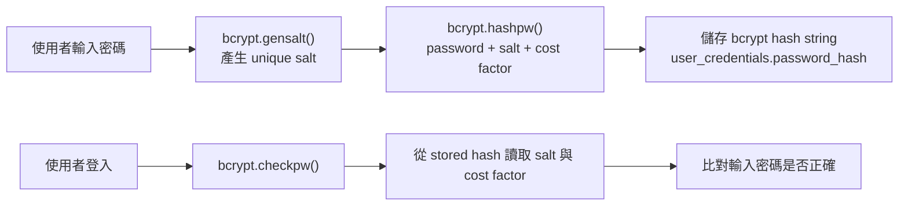

salt 的主要作用，是讓相同密碼不會產生相同的 hash。例如，假設兩個使用者都使用相同密碼 `password123`，bcrypt 仍然會因為每次產生的 salt 不同，而得到不同的 `password_hash`。因此，攻擊者即使看到兩筆 hash，也無法直接判斷這兩個使用者是否使用相同密碼。

這也可以防止 rainbow-table attacks。Rainbow table 是攻擊者預先計算好的一大批「常見密碼 → hash」對照表。如果系統使用沒有 salt 的 MD5 或 SHA-1，常見密碼很容易被直接查表反推。但 bcrypt 為每個密碼加入不同 salt 後，即使原始密碼相同，最終 hash 也會不同。這使得攻擊者無法有效使用一張通用的 rainbow table 來查出使用者密碼。

### 3.4 小結

總結來說，本系統在 password hashing 上採用 bcrypt，並將結果儲存在 `user_credentials.password_hash` 中。bcrypt 相較於 MD5 和 SHA-1，更適合密碼儲存，因為它支援 cost factor 與 key stretching，可以提高 brute-force attack 的成本。同時，bcrypt 會自動產生 salt，並將 salt embedded in hash string，使兩個相同密碼也會得到不同 hash，進而降低 rainbow-table attack 的風險。

---

## 4. Database Terminology and Schema Mapping

本節整理前面各 section 中使用到的資料庫術語，並將這些術語對應到本系統的實際 schema，說明本文件中的 normalisation、de-normalisation 與 schema design 討論，並非單純使用資料庫名詞，而是根據實際資料表、key constraint 與 functional dependency 進行分析，詳如下表:

### Terminology Mapping

| Term                        | Meaning                                                                                               | Example in this schema                                                                                                                                                                  |
| --------------------------- | ----------------------------------------------------------------------------------------------------- | --------------------------------------------------------------------------------------------------------------------------------------------------------------------------------------- |
| **Functional dependency**   | 某個欄位或欄位組合可以決定其他欄位，通常寫成 `A → B`                                                  | 在 `metro_schedule_stops` 中，`(schedule_id, stop_order) → station_id, travel_time_from_origin_min`                                                                                     |
| **Candidate key**           | 可以唯一識別一筆資料的最小欄位集合                                                                    | 在 `metro_schedule_stops` 中，`(schedule_id, stop_order)` 可以唯一識別同一個 schedule 中的某一站                                                                                        |
| **Primary key**             | 被實際選為資料表主鍵的 candidate key                                                                  | `metro_schedule_stops.id` 是該表實際使用的 primary key                                                                                                                                  |
| **Alternate candidate key** | 沒有被選為 primary key，但仍可以唯一識別資料列的 key                                                  | `(schedule_id, stop_order)` 透過 `UNIQUE` constraint 成為 alternate candidate key                                                                                                       |
| **Partial dependency**      | 在 composite key 中，非 key 欄位只依賴 key 的一部分，而不是依賴整個 key                               | 在 schedule stops 設計中，`station_id` 不應只依賴 `schedule_id`，而是要依賴完整的 `(schedule_id, stop_order)`                                                                           |
| **Transitive dependency**   | key 決定某個 non-key 欄位，而該 non-key 欄位又決定另一個 non-key 欄位，形成 `key → non-key → non-key` | 本系統沒有在 `metro_schedule_stops` 中重複保存 `station_name`，而是透過 `station_id` 連到 `metro_stations`，避免 `schedule stop → station_id → station_name` 這類 transitive dependency |
| **Junction table**          | 用來表示兩個 entity 之間關係的資料表，通常會包含兩邊的 foreign key                                    | `metro_schedule_stops` 連接 `metro_schedules` 與 `metro_stations`，表示某個 schedule 會停靠哪些 stations                                                                                |
| **De-normalisation**        | 刻意保留可推導資料，或不將資料拆到最細，以換取查詢或實作上的簡化                                      | `users.full_name` 可由 `first_name` 和 `surname` 推得，但仍被保留以簡化顯示與查詢                                                                                                       |
| **Update anomaly**          | 同一資訊重複保存時，如果更新不同步，可能造成資料不一致                                                | 如果修改 `users.first_name` 或 `users.surname`，但沒有同步更新 `users.full_name`，就可能產生姓名不一致                                                                                  |

# Section 3 : 圖形資料庫設計原理

## 1. 結構定義與設計動機

在本專案中，我們將交通網路模型化為圖形結構。

- **Nodes (節點):** 將「車站」定義為節點（標籤為 `MetroStation` 或 `NationalRailStation`），以 `station_id` 作為 Unique Identity。
- **Relationships (關係):** 站與站之間的行駛路線定義為關係（`METRO_LINK`, `RAIL_LINK`），跨系統轉乘則使用 `INTERCHANGE_TO`。
- **Properties (屬性):** 將 `travel_time_min` (行駛時間) 與 `standard_fare` (票價) 等數值作為關係的屬性（Edge Weights）。

**動機：** 交通路網本質上就是由點（車站）與線（軌道）構成的拓樸結構。將其儲存於圖形資料庫，能最直觀地反映真實世界的地理與營運樣貌，避免關聯式資料庫中複雜且不直觀的多對多關聯表設計。

## 2. 演算法正面對決：Neo4j vs PostgreSQL

面對複雜的路徑規劃任務（如：尋找最短路徑或延誤連鎖效應），Neo4j 具備絕對的演算法優勢：

- **Neo4j 的優勢：** 透過內建的 APOC 函式庫，我們能直接呼叫高效的 **Dijkstra 演算法** (`apoc.algo.dijkstra`)。圖形資料庫在底層使用「Index-Free Adjacency (無索引相鄰)」，在遍歷節點尋找路徑時，查詢時間僅與圖形的局部複雜度有關，與整體資料量無關，效能極高。
- **PostgreSQL 的劣勢：** 若堅持使用 SQL，必須依賴 **Recursive CTEs (遞迴公用表運算式)**。在計算路徑時，SQL 需要不斷執行昂貴的 JOIN 操作，並持續累積與過濾龐大的 Path Sets 以避免無限迴圈。在節點超過百個的真實路網中，效能將呈現指數級衰退。

## 3. 核心查詢情境展示

- **情境 A：跨網路轉乘路徑 (`query_interchange_path`)**
  透過簡單的 Cypher 語法 `MATCH p=shortestPath((start)-[:METRO_LINK|RAIL_LINK|INTERCHANGE_TO*]->(end))`，系統能自動跨越不同標籤的邊，輕鬆找出一條包含捷運與台鐵的混合路徑。這在 SQL 中需要極其複雜的 UNION 與多層 JOIN 才能勉強實現。
- **情境 B：避開特定車站 (`query_alternative_routes`)**
  圖形結構讓我們能輕易地在遍歷過程中加入條件過濾。透過 `WHERE NONE(n IN nodes(p) WHERE n.id = $avoid_station_id)`，演算法在搜索路徑時，只要遇到該故障站點就會自動剪枝（Pruning），高效找出完美的替代路線。

# Section 4 : Vector / RAG Design

本系統的 Vector / RAG 設計主要負責處理政策文件相關的自然語言查詢，例如退票規則、延誤補償、腳踏車規定等問題。這類資料通常不會是結構化的交易資料，而是以自然語言或JSON形式描述規則，因此不適合也幾乎無法使用關聯式資料庫。因此，為了使系統能理解使用者問題與政策文件間的語意關係，本系統使用PostgreSQL搭配 pgvector 建立向量資料庫，並透過 RAG pipeline 將相關政策內容提供給 LLM 作為回答依據。

---

## 4.1 what is embedded and why cosine similarity is appropriate for semantic search

### 4.1.1 what is embedded

本系統被嵌入成向量的資料是 **policy documents**，也就是政策文件。這些文件主要包含下列幾類資料：

| Policy document type     | Example content                                      |
| ------------------------ | ---------------------------------------------------- |
| Refund policies          | 退票規則、取消規則、延誤補償                         |
| Ticket type descriptions | single ticket、return ticket、day pass 等票種說明    |
| Booking rules            | 訂票、改票、兒童票、團體票、付款規則                 |
| Travel policies          | 行李、腳踏車、寵物、飲食、優先座、禁帶物品、乘車行為 |

這些資料之所以適合放入 Vector Database，是因為使用者通常不會完全使用政策文件中的原始詞彙發問。例如，政策文件中可能使用 “bicycle restrictions” 或 “cycle carriage rules”，但使用者可能問：

```text
Can I bring my bike on the metro?
```

這些句子在關鍵字上不太可能完全相同，但語意又高度相關。如果只使用 SQL 的 `LIKE` 或 exact keyword matching等方法，可能會因為用詞不同而查不到正確政策。然而，Embedding 則可以把文字轉換成高維度向量，使系統能根據語意相似度找出相關內容。

在資料建立階段，系統會將 policy documents 轉換成 embedding vectors，並存入 PostgreSQL 的 `policy_documents` table。這張表包含 `title`、`category`、`content`、`embedding`、`source_file` 與 `created_at` 等欄位，其中 `embedding` 欄位用來儲存政策文件的向量表示。schema 中也建立了 HNSW index，並使用 `vector_cosine_ops` 支援快速 cosine similarity search。

### 4.1.2 Why Cosine Similarity Is Appropriate

本系統使用 cosine similarity 進行 policy document retrieval，原因是 cosine similarity 很適合用於 embedding space 中的語意搜尋。

Cosine similarity 的重點不是比較兩個向量的長度，而是比較兩個向量的方向是否接近。換句話說，它是 **magnitude-independent** 的。即使兩個 embedding vector 的長度不同，只要它們在高維空間中的方向相似，cosine similarity 就會認為它們語意接近。

在 embedding space 中，向量方向可以視為文字語意的表示。若使用者問題與某份政策文件描述的是相同或相近的概念，它們的 embedding 應該會指向相近的方向。例如：

```text
User query:
Can I get compensation if my train is delayed?

Policy document:
Delay compensation is available when a national rail service is delayed by more than 30 minutes.
```

這兩段文字用詞不完全相同，但都與「train delay compensation」有關。因此，它們的 embedding 在語意空間中的方向應該接近。Cosine similarity 可以捕捉這種語意接近性，而不是只依賴表面字詞是否相同。

因此，cosine similarity 比單純關鍵字搜尋更適合本系統的政策查詢情境。它可以讓使用者用自然語言提出問題，系統再找出語意上最接近的政策文件。

---

## 4.2 Describes the full RAG pipeline: query embedding → similarity search → retrieved documents → LLM prompt → answer

### 4.2.1 Overall User Request Pipeline

說明 RAG pipeline 之前，先說明整個使用者請求從進入系統到回傳答案的完整流程。因為 RAG 並不是整個系統的全部流程，而是其中一個專門解決「政策文件語意檢索」問題的子流程。整體使用者請求流程如下：

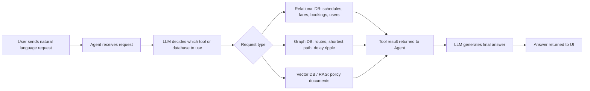

當使用者送出自然語言問題時，系統首先由 agent 接收請求。Agent 會將使用者問題交給 LLM 判斷該呼叫哪一個工具或資料庫查詢。

在這個流程中，不同類型的問題會被導向不同資料庫：

| 使用者問題類型                                       | 使用的資料庫 / 模組   | 原因                                            |
| ---------------------------------------------------- | --------------------- | ----------------------------------------------- |
| 查詢班次、票價、座位、訂票紀錄                       | Relational Database   | 需要 exact match、join、constraint、transaction |
| 查詢最快路線、最短路徑、轉乘路線、延誤影響           | Graph Database        | 適合處理 node、relationship、path traversal     |
| 查詢退票政策、延誤補償、行李、寵物、腳踏車、票種規則 | Vector Database / RAG | 適合自然語言政策文件的語意搜尋                  |

因此，RAG pipeline 解決的是整體使用者請求流程中的這個環節：

> 當使用者問題屬於政策、規則、補償、乘車規範等自然語言文件查詢時，系統需要從 policy documents 中找出語意最相關的內容，並把這些內容提供給 LLM 作為回答依據。

## 4.2.2 RAG Pipeline

呈上，RAG pipeline 用於解決使用者請求流程中的政策文件查詢環節。當 agent 判斷使用者問題屬於 policy question 時，例如退票、延誤補償、行李、寵物、腳踏車、訂票規則或票種問題，LLM 會呼叫 `search_policy` tool，具體流程如下圖:

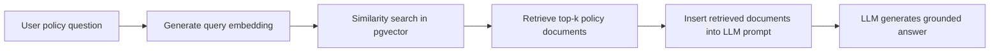

每步驟細節說明如次:

#### Stage 1: Query Embedding

第一步是將使用者的自然語言問題轉換成 query embedding。當使用者提出政策相關問題時，agent 會呼叫 `search_policy` tool。這個 tool 會使用目前設定的 embedding provider 將使用者問題轉成向量。

例如，使用者可能問：

```text
Can I bring my dog on the train?
```

系統會將這個問題轉換成一個高維度向量，儲存該問題的語意表示。然後，這個 query embedding 會被拿來與資料庫中已經儲存好的 policy document embeddings 做比較。

在程式中，`search_policy` 會先執行：

```python
embedding = llm.embed(params["query"])
```

接著再把這個 query embedding 傳入 vector search function。

#### Stage 2: Similarity Search

第二步是 similarity search。系統會將使用者問題的 query embedding 與 `policy_documents` table 中每一份政策文件的 embedding 進行 cosine distance / cosine similarity 比較。

本專案中，vector search 是由 `query_policy_vector_search()` 實作。這個 function 接收 query embedding，然後使用 pgvector 的 `<=>` operator 計算 cosine distance，再透過 `1 - distance` 轉換成 similarity score。SQL 查詢會篩選 similarity 大於 threshold 的文件，並根據距離由小到大排序，最後回傳 top-k 筆最相關的政策文件。

具體查詢邏輯如下：

```sql
SELECT title, category, content,
       1 - (embedding <=> query_vector) AS similarity
FROM policy_documents
WHERE similarity > threshold
ORDER BY embedding <=> query_vector
LIMIT top_k;
```

#### Stage 3: Retrieved Documents

第三步是取得 retrieved documents。Similarity search 完成後，系統會回傳 top-k 個最相關的 policy documents。根據設定檔，`VECTOR_TOP_K` 預設為 3，表示每次最多取回 3 筆最相關的政策文件；`VECTOR_SIMILARITY_THRESHOLD` 預設為 0.5，表示低於此相似度門檻的文件不會被回傳。

每一筆 retrieved document 通常包含：

| Field        | Meaning                                 |
| ------------ | --------------------------------------- |
| `title`      | 政策文件標題                            |
| `category`   | 政策類別，例如 refund、booking、conduct |
| `content`    | 政策文件內容                            |
| `similarity` | 與使用者問題的語意相似度分數            |

在 agent 中，`search_policy` 取得文件後，會整理每份文件的 title、category、content 與 similarity，並把文件內容截取一定長度後交給後續回答流程使用。

#### Stage 4: LLM Prompt with Retrieved Context

第四步是將 retrieved documents 放入 LLM prompt。
也就是retrieved documents 會成為 LLM 的 grounding context 這可以降低幻覺的風險，讓答案更準確。

例如，如果使用者問：

```text
My train was delayed by 45 minutes. Can I get a refund?
```

RAG pipeline 會先找出 delay compensation policy。然後 LLM 會根據 retrieved policy document 回答，而不是自己瞎猜補償規則。

#### Stage 5: Final Answer

最後，LLM 根據 retrieved documents 產生自然語言回答，並回傳給使用者。

綜上，RAG pipeline 在整體系統中扮演的角色可以總結為：

```text
User policy question
→ query embedding
→ vector similarity search
→ retrieve relevant policy documents
→ provide documents as context to LLM
→ generate grounded answer
```

---

可以，這兩段可以濃縮成下面這樣，語氣比較像設計文件中的說明，不會太長篇。

---

## 4.3 Embedding Dimension Choice

本系統的 embedding dimension 必須和 embedding provider 保持一致。專案主要支援兩種 embedding model：Ollama 的 `nomic-embed-text` 會產生 **768 維**向量，而 Gemini 的 `gemini-embedding-001` 會產生 **3072 維**向量。

本組一開始主要使用預設的 Ollama，因此 `policy_documents.embedding` 欄位設定為：

```sql
embedding vector(768)
```

不過在開發過程中，發現本地 1B 模型在 tool selection 上表現不夠力，工具很常選錯。為了確認問題是出在 query/tool 設計，還是模型太拉，過程中有切換成 Gemini API 進行測試。因為 Gemini embedding 是 3072 維，所以也需要同步把資料庫欄位改成：

```sql
embedding vector(3072)
```

簡單來說，embedding model 產生幾維向量，資料庫的 `vector(...)` 就必須設定成相同維度。

如果在 policy documents 已經 seeding 完之後才切換 embedding provider，不能只改 `.env` 中的LLM_PROVIDER，因為不同 provider 產生的向量維度不同。

例如，一開始用 Ollama seed，資料庫裡的 policy documents 都是 **768 維**向量；但後來切到 Gemini，新的使用者 query embedding 會變成 **3072 維**。這時候系統就會拿 3072 維的 query vector 去比對 768 維的 document vectors，造成 dimension mismatch。

所以切換 embedding provider時還要做這幾件事：

```text
修改 embedding dimension
→ 修改 schema.sql中的 vector(...) 維度
→ 重新執行 python skeleton/seed_vectors.py ，讓它產生新的向量
```

簡單說就是：**換 embedding model，就要同步換資料庫 vector 維度，並重新 seed。否則 query vector 和 document vector 維度不同，Vector search 就不能正常運作。**

# Section 5 : AI Collaboration Examples

本文件記錄我在 TransitFlow 專案中如何使用 AI 工具（例如 Cursor、Gemini、Codex 等）協助完成資料庫設計、查詢實作、Graph extension、Vector/RAG extension，以及除錯修正。每個例子都包含 Context、Prompt、Outcome 三個欄位。

---

## Example 1: 使用 Rules / Skills 規範讓 AI 生成程式碼與修改 SQL

### Context（上下文）

在實作 `schema.sql`、`databases/relational/queries.py` 和 seeding scripts 時，我發現如果只對 AI 說「幫我寫 SQL」或「幫我實作這個 function」，AI 很容易產生看起來合理但不符合本專案的 code，例如使用不存在的 table name、改掉 function signature、沒有用 `%s` parameter、或回傳格式和 agent tool contract 不一致。

所以我把專案規範整理成 rules / skills 的md檔，再讓 AI 依照這些規範生成程式碼或修改 SQL。這些規範包含 coding style、資料庫命名、SQL 安全規則、固定 function signature、回傳格式、以及「不能發明不存在的表或欄位」，以及專案強制必須遵守的規範。

### Prompt（提示詞）

```text
你現在要依照我的 rules / skills 來協助我寫 code (會用@的方式夾帶我的skill跟rules的規範讓AI讀取)
請先告訴我如何實施這個過程，再產生專案程式碼的 Python / SQL / Cypher 修改。

```

### Outcome（結果）

AI 在 rules / skills 限制下產生的 code 比單純請它「幫我寫 function」更可用，可以更精準快速的產生出符合規範的內容，不用每次下prompt都要從新說明我目前需要遵守的底層規範，。

這種做法有用的地方是：

- AI 會遵守 `_connect()` 和 `RealDictCursor` 的既有 pattern。
- AI 會使用 `%s` parameter，降低 SQL injection 風險。
- AI 比較不會發明 `routes`、`fares`、`stations` 這種不存在於 schema 的 table。
- AI 會保留原本 function signature，不會讓 `skeleton/agent.py` 的 tool call 失效。

後續做的人工優化包括：

- 對照 `databases/relational/schema.sql` 檢查每個 table / column 是否真的存在。
- 補上 `is_deleted = FALSE` 條件，避免查到 soft-deleted records。
- 檢查回傳欄位是否包含 agent 後續會用到的 `schedule_id`、`stops_travelled`、station names 和時間資訊。
- 用 `scripts/check_relational_queries.py` 檢查 function 是否能被測試腳本正常呼叫。

用同樣的 rules / skills 方法讓 AI 修改 SQL schema，不是直接接受 AI code，而是先用 SKILL限制輸出規範並且告知如何更改，不要先動專案內容，再來才去修改裡面的程式碼，

---

## Example 2: 翻車案例 (2) — 空陣列導致正常查詢中斷

### Context（上下文）

在修復完繞道邏輯後，我重置資料庫，將所有車站設為未封閉，並進行正常路徑查詢。理論上，沒有任何車站被封閉時，系統應該回傳正常 route；結果系統卻莫名其妙回傳：

```json
{ "found": false }
```

這導致正常導航完全癱瘓。也就是說，原本為了支援 station closure / rerouting 的邏輯，反而讓「沒有封閉車站」這個最基本的情境壞掉。

### Prompt（提示詞）

```text
我已經把所有 station 都 reset 成 open / not closed。
現在我在 Debug 面板輸入正常起終點，理論上應該找得到 route，
但結果回傳 {"found": false}。

我附上 Debug 面板截圖，裡面可以看到：
- 起點和終點都是存在的 station。
- 沒有任何 station 被關閉。
- route query 卻回傳 found: false。

這樣是對的嗎？
```

### Outcome（結果）

AI 再次給出爛答案。AI 先前設計的備用 Cypher 中有一行：

```cypher
MATCH (closed:Station {is_closed: true})
```

這行原本是用來抓取被封閉車站的黑名單，但它沒有考慮到當系統內「無封閉車站」時，這個 `MATCH` 會回傳空結果，並直接中斷整個查詢。換句話說，查詢還沒有走到真正找路的部分，就因為 closed station blacklist 是空的而失敗。

我透過 Debug 面板截圖發現問題：所有車站都已 reset 成 open，但正常路徑仍然回傳 `found: false`。這代表錯誤不是 station 狀態本身，而是 Cypher 查詢邏輯在「沒有封閉車站」時處理錯誤。

AI 後來捨棄了容易出錯的黑名單變數寫法，改用更直接的原生 path filtering：

```cypher
WHERE ALL(n IN nodes(p) WHERE n.is_closed = false OR n.is_closed IS NULL)
```

這個修正不需要先建立 closed station blacklist，而是直接檢查候選路徑上的每一個 node。只要路徑上的 station 沒有被標記為 closed，就允許這條路徑通過；如果舊資料沒有 `is_closed` 屬性，也視為 open。最後這才徹底解決了空陣列 / 空結果導致正常查詢中斷的問題。

---

## Example 3: 翻車案例 — AI 產生錯誤 Booking Constraint

### Context（上下文）

當我用 AI 協助整理 booking schema 時，AI 一開始給出了一個看起來合理、但不符合實際訂票需求的 constraint。問題不是 SQL 不能執行，而是它會讓「已取消的訂位」仍然永久佔用座位。

錯誤初稿類似：

```sql
ALTER TABLE bookings
    ADD CONSTRAINT uq_booking_seat_date
    UNIQUE (schedule_id, travel_date, seat_id);
```

這段 SQL 的問題是它沒有考慮 `status = 'cancelled'` 和 `is_deleted = TRUE` 的資料。只要某個座位曾經被訂過，即使後來取消，這個 unique constraint 仍然會阻止同一天同一班車再次賣出該座位。

### Prompt（提示詞）

```text

ALTER TABLE bookings
    ADD CONSTRAINT uq_booking_seat_date
    UNIQUE (schedule_id, travel_date, seat_id);

當我cancelled booking 之後，座位不應該繼續佔用；
也有 is_deleted 欄位，soft-deleted booking 不應該被視為 active。

請幫我檢查這個 constraint 是否符合需求。
如果不符合，請幫我修改已達成需求。
```

### Outcome（結果）

AI review 後指出一般 `UNIQUE` constraint 無法加上 `WHERE` 條件，因此不適合這個需求。這次應該使用 PostgreSQL 的 partial unique index，只限制 active bookings。

如何發現錯誤：

- 我取消一筆 booking 後，發現同一日期同一座位理論上應該可以再次被訂走。
- 但一般 `UNIQUE (schedule_id, travel_date, seat_id)` 會把 cancelled records 也算進去。
- 我把 booking table 的 `status`、`is_deleted` 欄位和需求一起貼回 AI，要求它只修正 constraint，不要重寫整個 schema。

最後修正為目前 `databases/relational/schema.sql` 中的版本：

```sql
CREATE UNIQUE INDEX IF NOT EXISTS ux_bookings_active_seat_date
    ON bookings(schedule_id, travel_date, seat_id)
    WHERE status != 'cancelled' AND is_deleted = FALSE;
```

---

# Section 6 : Reflection and Trade-offs

本節簡要回顧本系統中幾個主要設計決策，以及如果系統進入 production 環境時需要調整的部分。整體而言，本系統的設計目標是在資料結構清楚、功能容易實作、以及安全性之間取得平衡。

## 1. Design Decision 1: 將 schedule stops 拆成獨立資料表

第一個重要設計決策，是將班次的停靠站資料拆成 `metro_schedule_stops` 與 `national_rail_schedule_stops`，而不是直接把所有停靠站存在 `metro_schedules` 或 `national_rail_schedules` 的單一欄位中。

這樣設計的原因是，一個 schedule 會經過多個 stations，而每個 stop 又有自己的 `stop_order` 和 `travel_time_from_origin_min`。這些資料不是 schedule 本身的單一屬性，而是 schedule 和 station 之間的有序關係。將它們拆成獨立資料表後，每個 stop 都可以作為獨立 row 被查詢、更新與約束，也可以透過 foreign key 連接 schedule 和 station。

這個設計的好處是資料結構更清楚，也更容易查詢某一班次的完整停靠順序、計算兩站之間的站數與 travel time。它的 trade-off 是查詢時需要額外 join schedule table、station table 和 schedule stops table，但這個成本是可以接受的，因為換來的是更好的資料一致性與可維護性。

## 2. Design Decision 2: 使用 bcrypt 儲存使用者密碼

第二個重要設計決策，是使用 bcrypt 來儲存使用者密碼，而不是使用 MD5、SHA-1 或 Argon2。

這樣設計的原因是，密碼儲存需要抵抗 brute-force attack 和 rainbow-table attack。MD5 和 SHA-1 的計算速度很快，這在檔案完整性檢查等用途上是優點，但在密碼儲存上反而會讓攻擊者可以高速嘗試大量密碼。bcrypt 則是專門為 password hashing 設計的演算法，支援 cost factor 和 key stretching，可以增加每一次密碼猜測的計算成本。

我們也考慮過 Argon2。Argon2 是更現代的 password hashing algorithm，並且具有 memory-hard 的特性，可以提高 GPU 或專用硬體暴力破解的成本。不過，本系統是一個課程 prototype，主要目標是清楚展示安全的 password hashing 流程，而 bcrypt 在 Python 中有成熟、穩定且容易使用的 library 支援，並且已經能滿足本系統對 salt、cost factor 與 password verification 的需求。因此，我們選擇 bcrypt 作為較簡單、穩定、容易實作與說明的方案。若系統未來進入更高安全需求的 production 環境，Argon2id 會是值得重新評估的選項。

## 3. Production Difference: 使用 connection pooling 管理資料庫連線

目前的 prototype 中，每次資料庫操作都會透過 `_connect()` 或 `_tx_connect()` 建立新的 PostgreSQL connection，並在操作結束後關閉。這種 per-operation connection 的做法簡單、清楚，適合課程專案、低流量測試與展示 SQL query 的執行流程。

不過，如果系統進入 production 環境，這種連線方式應該改成 **connection pooling**。在真實使用情境中，可能會有多個使用者同時查詢路線、票價、座位、訂票紀錄或政策文件。如果每一次操作都重新建立與關閉 PostgreSQL connection，會增加額外成本，也可能在高併發下耗盡資料庫可用連線數。

因此，在 production system 中，可以使用 `psycopg2.pool`、PgBouncer，或部署平台提供的 database connection pool。這樣應用程式就可以重複使用既有連線，而不是每次 request 都重新建立連線。這會讓系統在多使用者同時使用時，有更好的效能與穩定性。

# Section 7 : Optional Extension

本組在 Task 6 中完成兩個 optional extensions。第一個是 **Graph Extension：即時車站封閉繞道系統**，讓系統可以將特定車站標記為關閉，並讓 Neo4j 路徑查詢避開已關閉車站。第二個是 **Vector / RAG Extension：Service Disruption Policy RAG Extension**，新增服務中斷相關政策文件，讓 `search_policy` 可以透過 pgvector similarity search 回答接駁巴士、嚴重服務中斷退款與替代交通補償等問題。

這兩個 extension 都有實際修改 database-related code 或 seed data，不是單純的 UI 或外觀修改。

---

## 1. Motivation

原本的 TransitFlow assistant 已經可以處理基本的路線查詢、票價查詢、訂票、取消訂票，以及一般政策查詢。然而，真實交通系統中常會發生突發狀況，例如車站因事故或維修暫時關閉、服務中斷、需要接駁巴士，或乘客需要申請替代交通費用補償。這些情境會同時影響「路線規劃」與「乘客權益政策」。

Graph extension 的目標是讓系統能處理即時營運狀態。當某個車站被標記為 closed 後，route query 不應該仍然規劃經過該車站的路線。因此，我們在 Neo4j 的 `Station` 節點加入 `is_closed` 屬性，並修改路徑查詢，使系統能避開已關閉車站。這讓 TransitFlow 更接近真實交通系統中的即時路線調整需求。

Vector / RAG extension 的目標則是補足服務中斷相關政策。原本的 RAG policy documents 已能回答退票、延誤補償、行李、寵物、腳踏車等一般政策問題，但對於 replacement bus、severe service disruption refund、alternative transport reimbursement 等情境支援不足。因此，我們新增 `service_disruption_policy.json`，並將其中的政策內容 seed 成 pgvector 中的 policy documents，使使用者詢問服務中斷相關政策時，系統可以透過 semantic search 找到正確政策文件。

---

## 2. Database and Graph Changes

### 2.1 Graph Extension — 車站封閉狀態

Graph extension 修改 Neo4j graph database，使每個 `Station` node 都可以記錄目前是否關閉。所有 `Station` node 在 seed 階段加入：

```text
Station.is_closed = false
```

當使用者要求關閉或重新開啟車站時，agent 會呼叫：

```text
toggle_station_closure(station_id, close_station)
```

底層會執行 Neo4j Cypher，將指定車站的 `is_closed` 狀態改為 `true` 或 `false`：

```cypher
MATCH (n:Station {id: $station_id})
SET n.is_closed = $status
RETURN n.name AS name, n.is_closed AS is_closed
```

當 `close_station = true` 時，代表車站被標記為 closed；當 `close_station = false` 時，代表車站重新開啟。

此外，route query 也被修改，使路徑規劃避開已關閉車站。例如 shortest route 查詢會過濾掉包含 closed station 的 path：

```cypher
WHERE ALL(n IN nodes(p) WHERE n.is_closed = false OR n.is_closed IS NULL)
```

或使用等價的 closed-station exclusion logic：

```cypher
WHERE NONE(n IN nodes(p)[1..-1] WHERE n.is_closed = true)
```

因此，如果 `NR03` 被標記為 closed，系統重新查詢 `NR01` 到 `NR05` 的路線時，就不應該再回傳經過 `NR03` 的 path。

若使用 PostgreSQL audit table 記錄封閉事件，schema 如下：

```sql
CREATE TABLE IF NOT EXISTS station_closures (
    id SERIAL PRIMARY KEY,
    station_id VARCHAR(10) NOT NULL,
    reason TEXT NOT NULL,
    closed_at TIMESTAMPTZ NOT NULL DEFAULT NOW(),
    reopened_at TIMESTAMPTZ,
    is_active BOOLEAN NOT NULL DEFAULT TRUE
);
```

這個 table 用來保存車站封閉與重啟歷史；Neo4j 的 `Station.is_closed` 則負責即時路線查詢時的 operational status。

### 2.2 Vector / RAG Extension — 服務中斷政策文件

Vector / RAG extension 沒有新增新的 vector table，而是使用既有的 pgvector table：

```sql
policy_documents(title, category, content, embedding, source_file)
```

我們新增 `train-mock-data/service_disruption_policy.json` 作為新的 seed data，並在 `skeleton/seed_vectors.py` 的 `build_documents()` 中讀取該檔案。每一筆 service disruption policy 都會被轉成一個獨立的 RAG document，後續透過 `llm.embed()` 產生 embedding，再由 `store_policy_document()` 寫入 `policy_documents`。

新增的 vector entries 包含：

| Policy ID | Title                                        | Category             |
| --------- | -------------------------------------------- | -------------------- |
| `SD001`   | `Station Closure Policy`                     | `service_disruption` |
| `SD002`   | `Replacement Bus Service Policy`             | `service_disruption` |
| `SD003`   | `Severe Service Disruption Refund Policy`    | `service_disruption` |
| `SD004`   | `Alternative Transport Reimbursement Policy` | `service_disruption` |

在 `seed_vectors.py` 中，新增的 seeding logic 如下：

```python
# TASK 6 EXTENSION:
# service_disruption_policy.json adds new vector/RAG knowledge entries for
# service disruption scenarios. Each policy is stored as one independent
# document so pgvector can retrieve the exact rule most relevant to a user
# question, such as station closures, replacement buses, severe disruption
# refunds, or alternative transport reimbursement.
for policy in _load("service_disruption_policy.json"):
    docs.append({
        "title": policy["label"],
        "category": "service_disruption",
        "source_file": "service_disruption_policy.json",
        "content": _text(policy),
    })
```

重新執行 vector seeding 時，這些 documents 會透過以下流程寫入 pgvector：

```python
embedding = llm.embed(doc["content"])

doc_id = store_policy_document(
    title=doc["title"],
    category=doc["category"],
    content=doc["content"],
    embedding=embedding,
    source_file=doc.get("source_file", ""),
)
```

這讓 `search_policy` 可以使用 query embedding 和 pgvector similarity search 找出服務中斷相關政策。

---

## 3. Example Queries and Expected Output

### 3.1 Graph Query Example — 關閉車站並重新繞道

第一組測試用來確認 station closure extension 是否能改變 graph 狀態，並影響後續路線查詢。

**Step 1 — 車站關閉前的正常路線**

User query:

```text
How do I get from Central (NR01) to Stonehaven (NR05)?
```

Expected result:

```text
系統回傳 NR01 到 NR05 的正常最短路徑。
在車站未關閉前，這條路線可能會經過 Old Town / Old Town Junction (NR03)。
```

**Step 2 — 關閉 Old Town station**

User query:

```text
Old Town station (NR03) has an emergency. Please close this station.
```

Expected tool call:

```json
{
  "name": "toggle_station_closure",
  "params": {
    "station_id": "NR03",
    "close_station": true
  }
}
```

Expected output:

```text
Station Old Town / Old Town Junction (NR03) is now CLOSED.
```

等價的 Neo4j 操作如下：

```cypher
MATCH (n:Station {id: 'NR03'})
SET n.is_closed = true
RETURN n.name, n.is_closed
```

Expected Cypher output:

| name                         | is_closed |
| ---------------------------- | --------- |
| Old Town / Old Town Junction | true      |

**Step 3 — 車站關閉後再次查詢路線**

User query:

```text
Now, how do I get from Central (NR01) to Stonehaven (NR05) again?
```

Expected result:

```text
系統回傳一條新的 NR01 到 NR05 路線，且該路線不會經過 NR03。
```

這可以驗證更新後的 route query 確實使用 `Station.is_closed` 狀態，並排除已關閉車站。

### 3.2 Vector / RAG Query Example — 接駁巴士政策

這個 query 用來測試新增的 service disruption policy documents 是否有被正確嵌入，並能從 pgvector 中被查回。

User query:

```text
Can I use a replacement bus if metro service is suspended?
```

實際觀察到的 tool call：

```json
{
  "name": "search_policy",
  "params": {
    "query": "can i use replacement bus if metro service is suspended"
  }
}
```

Expected retrieved document:

| Title                            | Category             | Similarity |
| -------------------------------- | -------------------- | ---------: |
| `Replacement Bus Service Policy` | `service_disruption` |    `0.732` |

這表示系統成功將使用者的政策問題導向 `search_policy`，並透過 query embedding 到 `policy_documents` 中找回新增的 `SD002` 政策。

### 3.3 Vector / RAG Query Example — 嚴重服務中斷退款政策

User query:

```text
What is the service disruption refund policy?
```

Expected tool call:

```json
{
  "name": "search_policy",
  "params": {
    "query": "severe service disruption refund policy"
  }
}
```

Expected retrieved document:

| Title                                     | Category             |
| ----------------------------------------- | -------------------- |
| `Severe Service Disruption Refund Policy` | `service_disruption` |

這個測試確認服務中斷相關的退款問題可以找回新增的 `SD003` policy document。

### 3.4 Vector / RAG Query Example — 替代交通補償政策

User query:

```text
What is the alternative transport reimbursement policy during severe service disruption?
```

Expected tool call:

```json
{
  "name": "search_policy",
  "params": {
    "query": "alternative transport reimbursement policy during severe service disruption"
  }
}
```

Expected retrieved document:

| Title                                        | Category             |
| -------------------------------------------- | -------------------- |
| `Alternative Transport Reimbursement Policy` | `service_disruption` |

這個測試確認替代交通費用補償相關問題可以找回新增的 `SD004` policy document。

---

## 4. Summary

Task6 的 extension 從兩個面向強化 TransitFlow。Graph extension 讓系統能反映即時營運狀態，支援將車站標記為 closed，並讓後續路線查詢避開已關閉車站。Vector / RAG extension 則擴充政策知識庫，將服務中斷相關政策嵌入 pgvector，使系統能回答接駁巴士、嚴重服務中斷退款與替代交通補償等自然語言政策問題。

整體而言，Graph extension 負責處理「交通網路狀態改變後如何重新規劃路線」，Vector / RAG extension 負責處理「服務中斷時乘客可以享有哪些政策權益」。兩者結合後，使 TransitFlow 在面對突發營運狀況時更完整、更接近真實交通服務系統。
